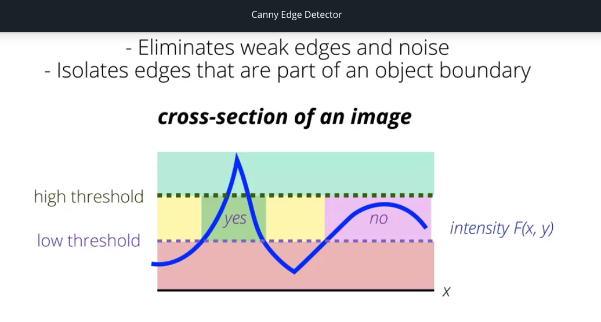
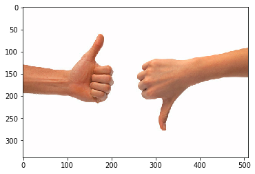

# 图片，三维数组
## OpenCV读图片是BGR，不是RGB，因为在当时开发OpenCV的时候，BGR模式在相机制造商和软件制造商中很受欢迎，红色通道被认为是最不重要的颜色通道之一。

# 蓝幕，绿幕
## 膨胀(Dilation, dilate)、腐蚀(Erosion, erode)

## mask = cv2.inRange(img, lower, upper)
如果不在这个范围内的部分，则是黑色，可以cv2.imshow(mask, cmap='gray')看看

## RGB(Red[0, 255], Green[0, 255], Blud[0, 255])

## HSV(Hue[0, 180], Saturation[0, 255], Value[0, 255])，色相，饱和度，明度
V通道,明度，这个分量受照明条件的影响最大
H通道，色相，基本不受阴影或过高亮度的影响。如果我们依赖这个通道、舍弃V通道，那就能对彩色物体进行检测，而且效果会比在RGB颜色空间中更为可靠

## HSL(Hue, Lightness, Saturation)色相，亮度，饱和度


## 亮度检测

# 边缘检测(Edge Detection)
## 声音频率，图像频率（frequency in images is a rate of change）

## 过滤器（Filters）
### 高通过滤器(High-pass)
高通过滤器用于锐化图像以及强化图像的高频区域，也就是相邻像素强度发生突变的区域，比如从极暗过渡到极亮的那些像素区域。
将一张灰阶图片通过高通过滤器——边缘强化（Emphasize Edges）。所谓边缘，就是指图像里强度发生突变的区域。通常暗示着物体边界的存在。
高通过滤器：
[0, -1, 0]
[-1, 4, -1]
[0, -1, 0]
3*3的卷积核，其元素总和为0
边缘检测时，所有元素总和为0是很重要的，因为这类过滤器要计算的是相邻像素的差异或者变化。要计算差异，就需要将像素值相减。在这里，我们要将中间像素与周围像素的值相减。如果这些核值加起来不等于0，那就意味着计算出来的差权重会有正负，结果就是滤波后的图像亮度会相应地提高或降低

在边缘检测时，如果没有先解决噪声，高通过滤器就会把噪声强化。低通过滤器（Low-pass Filter）是噪声最常见的解决方式。


```
filtered_image = cv2.filter2D(img, -1, kernal) # -1 means output as the same as input
retval, binary_image = cv2.threshold(filtered_image, 100, 255, cv2.THRESHOLD) # 阈值范围内的像素会变白色，其他的都是黑色（最低值越小，可以看到更多边缘）
```

#### Gradients
Gradients are a measure of intensity change in an image, and they generally mark object boundaries and changing area of light and dark. If we think back to treating images as functions, F(x, y), we can think of the gradient as a derivative operation F ’ (x, y). Where the derivative is a measurement of intensity change.

#### Sobel过滤器
Sobel filters
The Sobel filter is very commonly used in edge detection and in finding patterns in intensity in an image. Applying a Sobel filter to an image is a way of taking (an approximation) of the derivative of the image in the x or y direction. The operators for Sobel_x and Sobel_y, respectively, look like this:

Sobel过滤器可分别检测x和y轴方向的强度突变。
下面可以叫Sobel_x，可以用于检测垂直边缘
[-1, 0, 1]
[-2, 0, 2]
[-1, 0, 1]
角落的权重小于中心像素相邻的边缘的权重，中间填0，右边填正值。可以看到这个核值加起来等于0。一旦以某个图像像素作为这个核的中心，核就会开始计算左右两边的像素差，从而检测出垂直边缘。

Sobel_y
[-1, -2, -1]
[0, 0, 0]
[1, 2, 1]
检测水平边缘

Taking the gradient in the xx direction emphasizes edges closer to vertical. Alternatively, taking the gradient in the yy direction emphasizes edges closer to horizontal.

#### Magnitude
Sobel also detects which edges are strongest. This is encapsulated by the magnitude of the gradient; the greater the magnitude, the stronger the edge is. The magnitude, or absolute value, of the gradient is just the square root of the squares of the individual x and y gradients. For a gradient in both the xx and yy directions, the magnitude is the square root of the sum of the squares.

$abs\_sobel\_x = \sqrt{{sobel_x}^{2}}$
$abs\_sobel\_y = \sqrt{{sobel_y}^{2}}$
$abs\_sobel\_xy = \sqrt{sobel_x^{2} + sobel_y^{2}}$

#### Direction
In many cases, it will be useful to look for edges in a particular orientation. For example, we may want to find lines that only angle upwards or point left. By calculating the direction of the image gradient in the x and y directions separately, we can determine the direction of that gradient!

The direction of the gradient is simply the inverse tangent (arctangent) of the yy gradient divided by the xx gradient:

$ \tan^{-1}{\frac{sobel_y}{sobel_x}} $


### 低通过滤器（Low-pass Filter）
这类过滤器能阻挡特定高频部分、有效模糊图像或使图像平滑起来，从而减少高频噪声。
要降噪，我们可以取相邻像素的均值，从而避免强度突变，特别是小范围突变。而这种取空间像素均值的做法，同应用低通过滤器来过滤高频噪声是一样的。
如用普通核来降噪：
[1, 1, 1]
[1, 1, 1]
[1, 1, 1]
均值过滤器，3*3卷积核，会赋予中心像素及相邻像素一样的权重。低通过滤器通常会取均值，不像高通过滤器取得是差值，因此低通过滤器的元素加起来和应该为1，这就能保留图像的亮度，确保图像不会变亮或变暗。但这里这个核的元素加起来等于9，所以我们需要进行归一化处理，也就是将核值综合除以9，就是最后乘以一个1/9。
如果对整张图的所有像素进行同样的均值处理，我们就能使图像变得平滑，图像里的强度突变也会减少。这有利于减少噪声，或使处于一定强度范围的背景区域看起来更加平滑。（Photoshop里面的模糊/柔化处理）

#### 高斯模糊（Gaussian blur）
既能模糊图像，又能更好地保存图像边缘的过滤器
[1, 2, 1]
[2, 4, 2] * 1/16
[1, 2, 1]
或许是计算机视觉应用中最常用的低通过滤器了。
其实就是加权平均法，赋予中心像素最大的权重，但也会考虑到周围的像素，权重多少主要取决于周围像素有多接近中心像素。这与边缘检测过滤器类似，但这个过滤器的所有元素都是正值，而且经过归一化处理，总和为1。
（过滤器建得越大，模糊范围就会越大；过滤器的维度是奇数，这样才能把图像的每个像素作为核的中心）

（如脑结构图的例子，脑子以外的部分有很多噪点）通常对于许多图像，我们都会先对图像进行小型低通滤波处理，比如应用高斯模糊，从而去除噪声，然后再用高通过滤器来检测边缘。

#### what makes filters high and low-pass
Now, you might be wondering, what makes filters high and low-pass; why is a Sobel filter high-pass and a Gaussian filter low-pass?

Well, you can actually visualize the frequencies that these filters block out by taking a look at their fourier transforms. The frequency components of any image can be displayed after doing a Fourier Transform (FT). An FT looks at the components of an image (edges that are high-frequency, and areas of smooth color as low-frequency), and plots the frequencies that occur as points in spectrum.

CVND, P1, Course 3, Chapter 13

### Canny Edge Detector
我们需要思考，什么样的强度变化会形成边缘？如果边缘薄厚程度不同，我们又要怎么检测并将其表示出来呢？
最好用也是最常用的边缘检测之一，叫做canny边缘检测器，它能解决上述两个问题。
canny边缘检测器在计算机视觉领域应用十分广泛，因为该检测器会借助一些列操作，不断生成精准的检测边缘。
1. *Filters out noise* using a Gaussian blur
2. *Finds the strength and direction of edges* using Sobel Filters3. Applies *non-maximum supression* to isolate the strongest edges and thin them to one-pixel wide lines
4. Uses *hysteresis* to isolate the best edges

1. 检测器用高斯模糊过滤掉噪声；
2. 用Sobel过滤器确定图像边缘的强度和方向；
3. 借助Sobel过滤器的输出，Canny会用非极大抑制（non-maximum suppression）来观察每个检测边缘的强度和方向，选出局部最大像素，从而把最强的边缘绘制成连续的、一个像素宽的细线（which looks at the strength and direction of each detected edge and selects the local maximum pixel to create consistent one pixel wide thin lines that align with the strongest edges）；
4. 用滞后阀值（hysteresis thresholding）来分离最佳边缘。

*Hysteresis* is a double thresholding process.
滞后阀值是双阀值化操作。使用之后阀值时，我们要确定一个高阀值，以便允许这些强边缘通过；再设置一个低阀值，任何低于该阀值的边缘即为弱边缘，会被舍弃；位于高低阈值之间的边缘，只有当其与另一个强边缘相连时，才会得到保留。这样一来，canny就删除了弱边缘，消除了噪声，还将关联最强的那些边缘分离了出来，而这些边缘恰恰最可能是物体边界的一部分。
由于Canny着重强调重要边缘，所以它特别适合检测边界和形状。
```python3
lower = 120
upper = 240
edges = cv2.Canny(gray_img, lower, upper)
plt.imshow(edges, cmap='gray')
```
建议将高低阈值的比例保持在1：2，或者1：3。这两个比例的效果最佳


### Shape Detection
#### 霍夫变换（Hough transform）
霍夫空间（Hough Space, also called parameter space)
直线方程$y = mx + b$，在霍夫空间横轴坐标就是m（斜率），纵轴就是b（偏移）。图像空间（Image space）里的多条直线，可以在霍夫空间里以多个m和b的坐标来表示，而霍夫空间呈现出来的不同模式能帮我们识别直线或其他形状。
如果是垂直的直线x = b，理论上讲，这样的直线斜率是无穷的。所以更好的图像空间转换方法，是将霍夫空间转为极坐标(polor coordinates)。
$\rho = x\cos\theta + y\sin\theta$
这样一来，我们用的就不是m和b了，而是$\rho$和$\theta$——$\rho$表示的是直线与原点的距离，$\theta$表示的是直线与横轴所成的角。
于是一条分段的线或一条由点组成的线，在霍夫空间里会被识别为相交的正弦曲线（why？）

```python3
gray = cv2.cvtColor(image, cv2.COLOR_RGB2GRAY)

# Define out parameters for Canny
low_threshold = 50
high_threshold = 100
edges = cv2.Canny(gray, low_threshold, high_threshold)
# 至此会检测到许多不连贯的小边缘

# 用霍夫变换将这些线段连在一起，形成连续的直线
#rho 和 theta就是我们的霍夫变量，两者定义了检测的分辨率
rho = 1 # 1像素
theta = np.pi/180 # 1度（one degree）
threshold = 60 # 霍夫空间要找到一根直线所需的最少相交数
min_line_length = 50 # 最小线条长度
max_line_gap = 5 # 线条分段之间的距离
# Find lines using a Hough transform
lines = cv2.HoughLinesP(edges, rho, theta, threshold, np.array([]), min_line_length, max_line_gap) # 空数组是要传的

#这个函数会返回其检测到的所有霍夫直线。每根直线实际上市一个包含着四个点的数组（x1, y1, x2, y2）
```


##### Hough变换的优缺点
* 优点：
抗噪能力强
对边缘间断不敏感
* 缺点：
运算量大：对图像中每一个像素点，都需要计算所有的theta对一个的rho
占用内存多
* Hough变换利用的是一种投票思想

### Haar Cascade and Face Recognition（Haar级联）
首先，算法会从每个图像中检测出所谓的Haar特征。
Haar特征就是梯度测量值。测量时，算法胡观察某个特定像素区域周围的矩形区域，以某种方式减去这些区域，从而计算像素差。这与卷积核的工作原理有些类似，但是规模更大。Haar特征能检测边缘、线条和更复杂的矩形模式。
在人脸检测中，线条和矩形是特别使用的特征，因为阴暗交替的区域块能确定许多脸部特征：比如，我们的瞳孔通常都是一种很黑的特征，脸颊和下巴则确定了脸部的高梯度轮廓。
到目前为止Haar特征的步骤看起来很像卷积神经网络的前几步，甚至像HOG特征提取的前几步，但下一步就不同了，下面是一系列的级联（cascades）。
任意人脸图像，有很大一部分都是非人脸区域，所以Haar级联会观察图像，对图像应用Haar特征检测器，比如垂直线检测器等，然后对整张图像进行分类处理。如果特征检测器回应不够，那Haar级联就会将图像的一部分区域归为“非人脸”并舍弃这部分信息，然后将经过删减的图像，放到下一个特征检测器中，再次进行图像分类，每次都会舍弃一部分无关的非人脸区域。我们称这个过程为“分类起的级联（）cascade of classifiers”。通过这种方法Haar级联能重点处理并识别图像的特定部分，即已归为人脸的部分。这种迅速舍去图像无关数据的举措使得这个算法运算十分迅速，我们还可以用Haar级联选出特定区域来进行后续处理。


### Corner Dectection
角点（Corners）是最容易匹配的，是独一无二的。
边缘检测时，我们会观察相邻像素间的强度（intensity）差异，如果强度变化很大而且很突兀（a big and abrupt change），那我们就会检测到边缘，不管是什么方向。
图像强度也被成为图像梯度（image gradient），要检测角点，我们也可以靠这类梯度测量法来进行。
我们知道角点就是两个边缘的相交点，我们可以借住窗口(window)来检测角点。所谓窗口一般指的是一个正方形区域，其中包含了一组像素，通过该区域，我们可以观察各方向，找出高梯度的部分，每个方向的梯度测量都会有一个幅值（magnitude），即梯度强度的度量值（a measurement of the strength of the gradient），和表示强度变化的方向（direction of the change in intensity），这些值都能用Sobel算子计算出来。
Sobel算子会分别取x和y方向的强度变化或图像梯度（不需要转为二进制阀值图像）。然后我们需要计算出这两个方向总梯度的幅值和方向。因此我们需要将这些值从图像空间的xy坐标系，转换成极坐标系，以$\rho$表示幅值，$\theta$表示方向。这看起来可能有点像霍夫变换。
在极坐标系中，在任意像素位置中，我们可以把$G_x$和$G_y$想象称梯度三角形两边的长——Gx是底边的长，Gy是右边的长。所以梯度的总幅值$\rho$就是三角形的斜线$\rho=\sqrt{G_x^{2}}+{G_y^{2}}$，而梯度方向$\rho$则是Gy除以Gx的正切的倒数$\theta=\tan^{-1}\frac{G_y}{G_x}$
计算所得的梯度幅值图像中，最大的梯度对应最明亮的线条。许多角点检测器会取一个窗口，并在梯度图像不同区域里上下左右移动这个窗口。如果我们移动的幅度很小，一旦遇到角点，窗口就会发现刚才计算出来的梯度方向和幅值有突变，因而识别出角点的存在。
```python3
import matplotlib.pyplot as plt
import numpy as np
import cv2

%matplotlib inline

image = cv2.imread("some.jpg")
image_rgb = cv2.cvtColor(image, cv2.COLOR_BGR2RGB)
plt.imshow(image_rgb)

# 角点检测靠的是强度变化，所以先把图像转化为灰度图像
# 然后将值转化为浮点型，以便Harris角点检测器使用
gray = cv2.cv2Color(image_rgb, cv2.COLOR_RGB2GRAY)
gray = np.float32(gray)

# Detect corners
# 灰度浮点值
# 检测潜在角点所需观察的相邻像素大小，2表示2*2方块，角点明显的图用这样的小窗口就够了
# Sobel算子的大小，卷积核大小，3是典型的核大小
# 最后一个参数是个常数，用来确定哪些点会被视为角点，通常设为0.04，如果这个数设得小一点，检测出来的角点就会多一些。
# return dst, 是个图像。这个图像会把角点标亮，非角点则会标为较暗的像素。
dst = cv2.cornerHarris(gray, 2, 3, 0.04)

plt.imshow(dst, cmap='gray')
# 显示出来的这张图实际上很难看到标亮的角点，所以我们要再加一步操作来处理这些角点——角点膨胀（dilate）
# 膨胀会放大明亮的区域
dst = cv2.dilate(dst, None)

# 最后要选取“超过一定亮度”的角点并显示
thredhold = 0.01*dst.max()

# Create an image to draw corners on
corner_image = np.copy(image_rgb)

# Iterate through all the corners and draw them on the image (if they pass the treshold)
for j in range(0, dst.shape[0]):
    for i in range(0, dst.shape[1]):
         if (dst[i, j] > thredhols):
            # image, center pt, radius, color, thickness
            cv2.circle(corner_image, (i, j), 2, (0, 255, 0), 1)

plt.imshow(corner_image)
# 如果角点少了，可能阀值太高了，可以调低一点看看
```
例子里面的图片是个黑白相间的棋盘，我们可以用这些角点来求取棋盘的面积，或取角点来进行视角变。
由此可见，仅仅是角点，对就多种分析和集合变换有大帮助了。

#### 图像描廓（Image Contouring）
Contours
- Continous curves that follow the edge along a boundary
- Provide a lot of information about the shape of an object boundary
- Detected whtn there is a white object against a black background
因此图像描廓可用于图像分割（Image segmentation），这能提供大量关于物体边界形状的信息。
在识别图像轮廓之前，我们要先为图像创建二进制阀值，这样才能用黑白像素将图像里不同的物体区分开来。然后我们用这些物体的边缘来行程轮廓。
这种二值图像通常只由一个阀值生成，或由Canny边缘检测器生成。
```python3
image = cv2.imread('some.jpg')
gray = cv2.cvtColor(image, cv2.COLOR_BGR2GRAY)
retval, binary_image = cv2.threshold(gray, 225, 255, cv2.THRESH_BINARY_INV)

# Find contours
# 灰度图像
# 轮廓检索模式
# 轮廓近似方法
# return 返回值，轮廓列表，轮廓层级
retval, contours, hierarchy = cv2.findContours(binary_image, cv2.RETR_TREE, cv2.CHAIN_APPROX_SIMPLE)
# hierarchy - 如多有诸多轮廓彼此嵌套，那这个层级就能派上大用场。层级定义了轮廓之间的关系

# Draw
# image
# 轮廓
# 哪些轮廓要画，-1表示全部
# 轮廓颜色
# 轮廓大小
all_contours = cv2.drawContours(image, contours, -1, (0, 255, 0), 2)
plt.imshow(all_contours)
# 利用这个轮廓，我们可以提取大量有关（这个例子是手部识别）手的形状信息：面积，形状中心，周长，外接矩形（Area, Center, Perimeter, Bounding Rectangle）；这些形状特征统称为轮廓特征（Contour Features）。
```


下面用这个图片作为例子，可以在图片外画矩形，识别图片的角度

```python3
import numpy as np
import matplotlib.pyplot as plt
import cv2

%matplotlib inline

# Read in the image
image = cv2.imread('images/thumbs_up_down.jpg')

# Change color to RGB (from BGR)
image = cv2.cvtColor(image, cv2.COLOR_BGR2RGB)

plt.imshow(image)

# Produce a binary image for finding contours
# Convert to grayscale
gray = cv2.cvtColor(image,cv2.COLOR_RGB2GRAY)

# Create a binary thresholded image
retval, binary = cv2.threshold(gray, 225, 255, cv2.THRESH_BINARY_INV)

plt.imshow(binary, cmap='gray')

# Find and draw the contours
# Find contours from thresholded, binary image
retval, contours, hierarchy = cv2.findContours(binary, cv2.RETR_TREE, cv2.CHAIN_APPROX_SIMPLE)

# Draw all contours on a copy of the original image
contours_image = np.copy(image)
contours_image = cv2.drawContours(contours_image, contours, -1, (0,255,0), 3)

plt.imshow(contours_image)

### Orientation

# The orientation of an object is the angle at which an object is directed. To find the angle of a contour, you should first find an ellipse that fits the contour and then extract the `angle` from that shape.

# Fit an ellipse to a contour and extract the angle from that ellipse
# (x,y), (MA,ma), angle = cv2.fitEllipse(selected_contour)

# **Orientation values**

# These orientation values are in degrees measured from the x-axis. A value of zero means a flat line, and a value of 90 means that a contour is pointing straight up!

# So, the orientation angles that you calculated for each contour should be able to tell us something about the general position of the hand. The hand with it's thumb up, should have a higher (closer to 90 degrees) orientation than the hand with it's thumb down.

def orientations(contours):
    """
    Orientation
    :param contours: a list of contours
    :return: angles, the orientations of the contours
    """

    # Create an empty list to store the angles in
    # Tip: Use angles.append(value) to add values to this list
    angles = []
    for x in contours:
        (x,y), (MA,ma), angle = cv2.fitEllipse(x)
        angles.append(angle)

    return angles

### Bounding Rectangle
# In the next cell, you'll be asked to find the bounding rectangle around the *left* hand contour, which has its thumb up, then use that bounding rectangle to crop the image and better focus on that one hand!

# Find the bounding rectangle of a selected contour
# x,y,w,h = cv2.boundingRect(selected_contour)

# Draw the bounding rectangle as a purple box
# box_image = cv2.rectangle(contours_image, (x,y), (x+w,y+h), (200,0,200),2)

And to crop the image, select the correct width and height of the image to include.

# Crop using the dimensions of the bounding rectangle (x, y, w, h)
# cropped_image = image[y: y + h, x: x + w]

def left_hand_crop(image, selected_contour):
    """
    Left hand crop
    :param image: the original image
    :param selectec_contour: the contour that will be used for cropping
    :return: cropped_image, the cropped image around the left hand
    """

    ## TODO: Detect the bounding rectangle of the left hand contour
    x,y,w,h = cv2.boundingRect(selected_contour)

    ## TODO: Crop the image using the dimensions of the bounding rectangle
    # Make a copy of the image to crop
    cropped_image = np.copy(image)
    cropped_image = cropped_image[y:y+h, x:x+w]

    return cropped_image

selected_contour = contours[1]

if(selected_contour is not None):
    # Call the crop function with that contour passed in as a parameter
    cropped_image = left_hand_crop(image, selected_contour)
    plt.imshow(cropped_image)
```


### K-means clustering
Separates an image into segments by clustering data points that have similar traits
```python3
import numpy as np
import matplotlib.pyplot as plt
import cv2

%matplotlib inline

image = cv2.imread("some.jpg")
image_rgb = cv2.cvtColor(image, cv2.COLOR_BGR2RGB)
plt.imshow(image_rgb)

# Reshape image into a 2D array of pixels and 3 color value
pixel_vals = image_rgb.reshape((-1, 3))

# Convert to float type
pixel_vals = np.float32(pixel_vals)

# Define stopping criteria （告诉算法何时停止）
# epsilon值迭代或最大次数
# 迭代最大次数
# 几次迭代后，若簇移动范围小于该值，则算法终止
criteria = (cv2.TERM_CRITERIA_EPS + cv2.TERM_CRITERIA_MAX_ITER, 10, 1.0)
k = 2
retval, labels, conters = cv2.kmeans(pixel_vals, k, None, criteria, 10, cv2.KMEANS_RANDOM_CENTERS)

# Convert data into 8-bit values
centers = np.uint8(centers) # shape is (k, 3), 3 for RGB value
segmented_data = centers[labels.faltten()]

# Reshape data into the original image dimensions
segmented_image = segmented_data.reshape((image.shape))
labels_reshape = labels.reshape(image.shape[0], image.shape[1])

plt.imshow(segmented_image)

# 可以把簇逐一呈现，就像用mask一样
plt.imshow(labels_reshape==1, cmap='gray')

# 还可以利用这些信息来对这部分图像进行mask处理
masked_image = np.copy(image_rgb)
mask_image[labels_reshape == 1] = [0, 0, 0]

# 这样可以看到labels_reshape == 1的部分没有了（变成黑色了）—
plt.imshow(masked_image)


```
