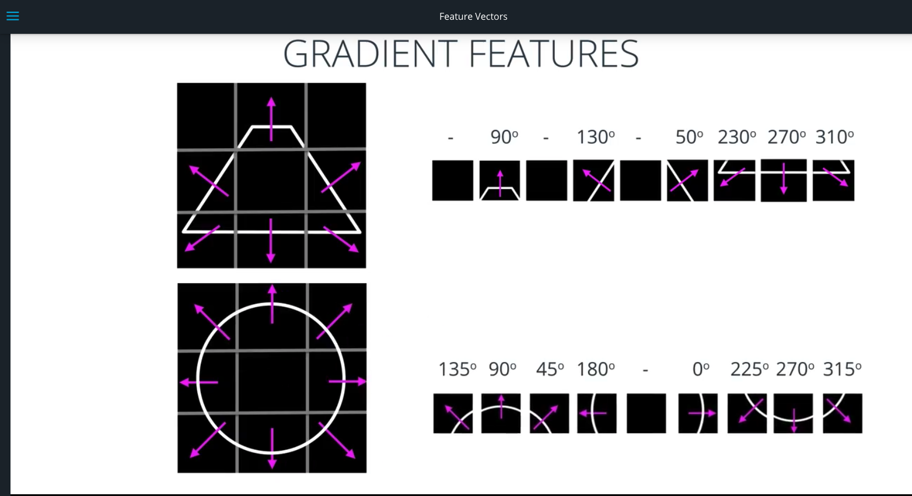
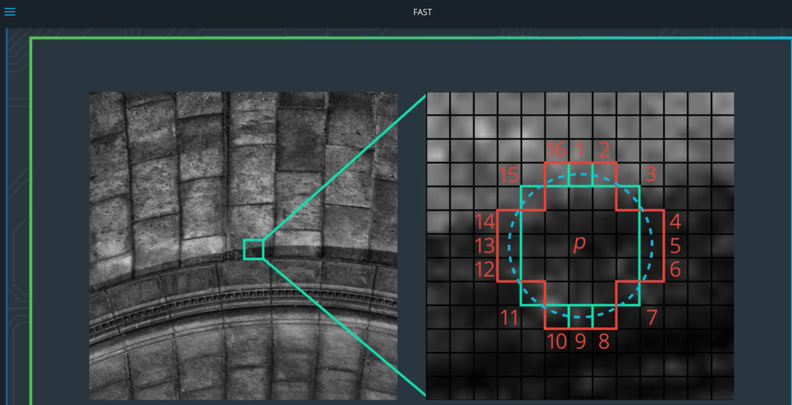
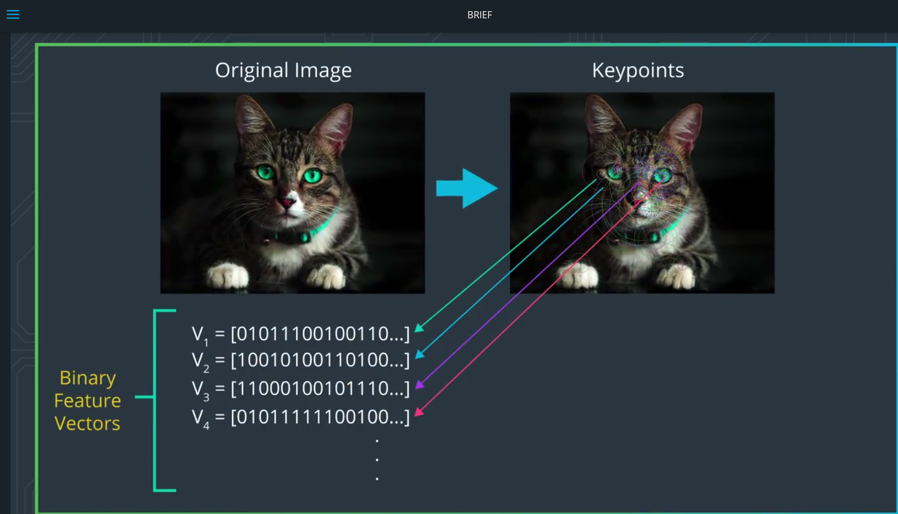
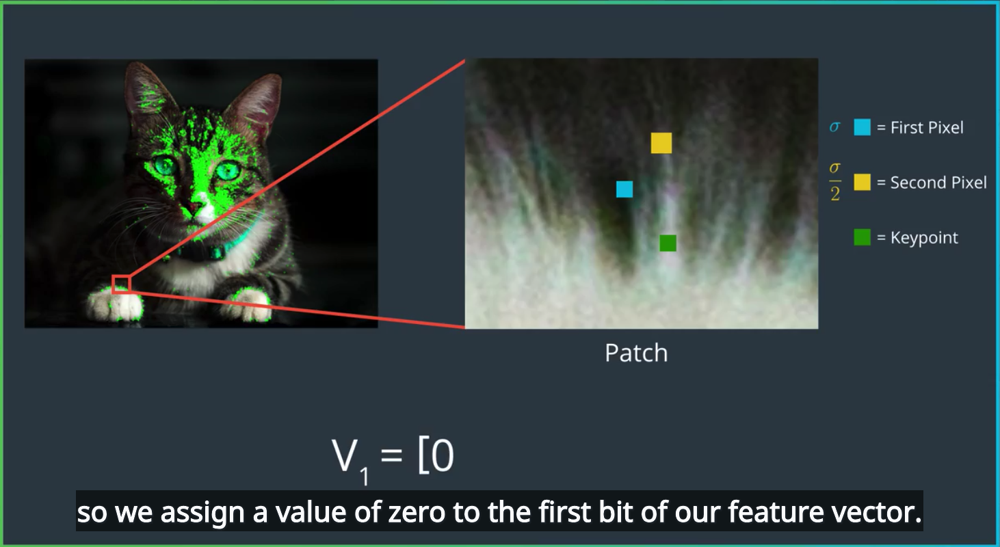
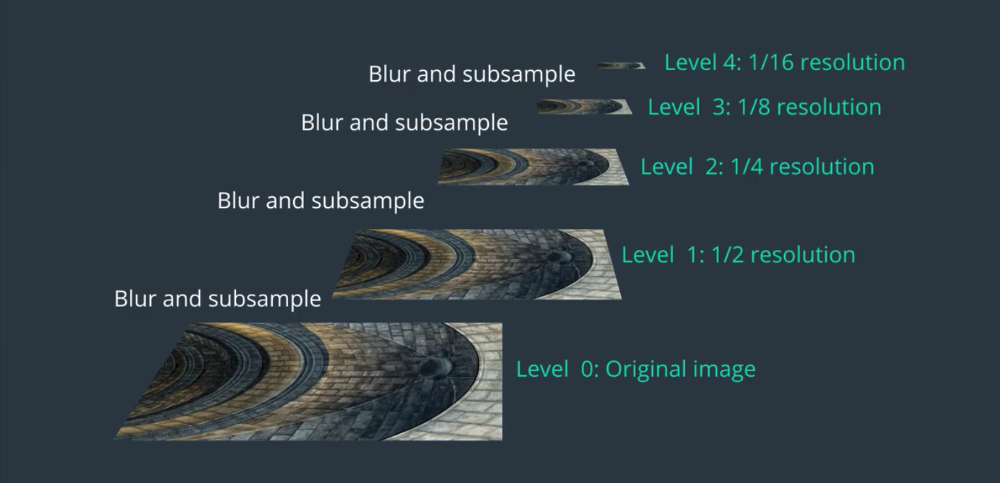
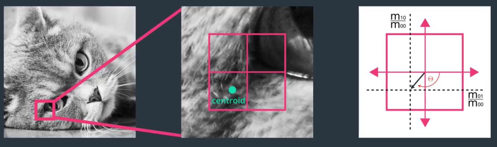
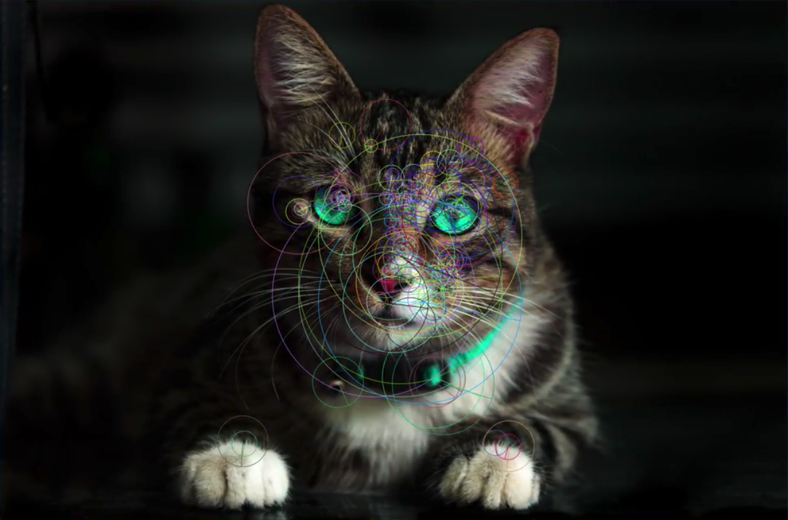
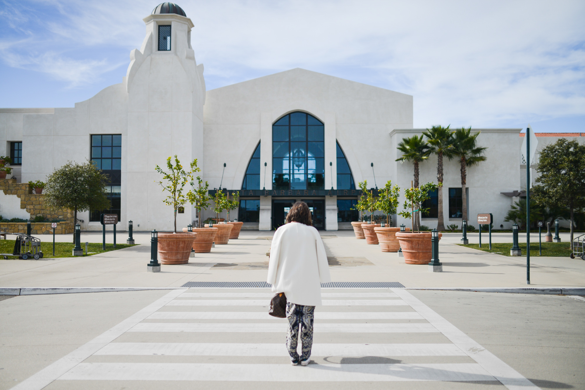

# Feature Vector
## Gradient features


## ORB (Oriented Fast, Rotated, Brief)
ORB
(
  **O** riented Fast,
  **R** otated,
  **B** rief
)
* FAST to locate the key points in an image
* Brief algorithm to convert these key points into feature vectors.
* use these to create vectors that are robust in the face of image rotation, scale and noise.

a feature detection in a vector creation algorithm respectively


### Keypoint 关键点
Small region in an image that is particularly distinctive
e.g. :
* Corners where pixel values sharply change from light to dark

ORB feature detection steps:
1. find the key points in an image, which is done by the FAST Algorithm.
2. Take the key points found by FAST algorithm and turn those into feature vectors that together can represent an object(uses the BRIEF algorithm).

#### FAST
(
  **F** eatures from,
  **A** ccelerated,
  **S** egments,
  **T** est
).
FAST algorithm quickly select key points by comparint the brightness levels in a given pixel area.
It compares the brightness of image `p`  to a set of 16 surrounding pixels that are in a small circle around p. Each pixel in this circle is then corted into three classes: brighter than p, darker than p or similar to p.


define the brightness of a pixel as $I_p$, intensity of pixel p. For a given threshold h, brighter pixels will be those whose brightness exceeds $I_p + h$. Darker pixels will be those whose brightness is below $I_p - h$, and similar pixel will be those whose brightness lie in-between those value, which is $I_p - h < similar < I_p + h$.

Once the pixels are classified, pixel $p$ is selected as a key point if more than 8 connected pixels on the circle are eighter darker or brighter than p.

The reason FAST is so efficient is that it takes advantage of the fact that the same result can be achieved by comparing $p$ to only four equidistant pixels in the circlr, instead of all 16 surrounding pixels.

For example, we only have to compare p to pixels 1, 5, 9, 13. In this case, p is selected as a key point if there are at least a pair of consecutive pixels that are either brighter or darker than p(如果至少有一对连续的像素比p更亮或更暗).

This optimization reduces the time required to search an entire image for key points by a factor of four(这种优化将搜索关键点整个图像所需的时间减少了四分之一。).

The key points found by FAST, give us information about the location of object defining edges in an image. However, one thing to note is that these key points only give us the location of an edge, and don't include any information about the direction of the change of intensity.

So, we can now distinguish between horizontal and vertical edges, for example. This directionality can be useful in some cases.

#### BRIEF
BRIEF
(
  **B** inary,
  **R** obust,
  **I** ndependent,
  **E** lementary,
  **F** eatures.
  )
Its purpose is to create binary feature vectors from a set of key points.


In BRIEF, each key point is described by a binary feature vector that has a 128-512 bits string that only contains ones and zeros.

Computers run on binary or machine code, and so the great advantage of using binary feature vectors is that they can be stored very efficiently in memory and they can be computed quickly. These properties not only make BRIEF very fast, which is crucial for eal time applications, but they also allow BRIEF to run on devices with very limited computational resources, such as you smartphone.

So, how does BRIEF create these binary descriptors for each point?

* The BRIEF algorithm starts by smoothing a given image with a Gaussian kernel in order to prevent the descriptor from being too sensitive to high frequency noise.

* Next, given a key point like the one here and the cat's paw, BRIEF selects a random pair of pixels inside a defined neighborhood around that key point. The neighborhood around the key point is known as a patch, which is a square with some pixel width and height.
The first pixel in the random pair, shown here is a blue square, is drawn from a Gaussian distribution centered around the key point, and with a standard deviation or a spread of Sigma: $\sigma$ （一个标准差）.
The second pixel in the random pair, shown here as a yellow square, is drawn from a Gaussian distribution centered around that first pixel and with a standard deviation of Sigma over 2: $\frac{\sigma}{2}$.
It's been shown empirically that this choise of Gaussians improves the feature matching rates.


* BRIEF then starts constructing the binary descriptor for the key point by comparing the brightness of the two pixels as follows: If the first pixel is brighter than the second, is assigns the value of one to the corresponding bit in the descriptor. Otherwise it assigns the value of zero.
In this example we see here, the secound pixel is brighter than the first pixel, so we assign a value of zero to the first bit of our feature vector.
The first bit of the feature vector corresponds to the first random pair of points for this key point. See the picture below.

Now, for the same key point, BRIEF selects a new random pair of pixels, compares their brightness and assigns one or zero to the next bit and the feature vector.
For a 256 bit vector, BRIEF then repeats this process for the same key point 256 tims before moving onto the next key point. The result of the 256 pixel brightness comparisons are then put into the binary feature vector for that one key point.
BRIEF creates a vector like this for each key point in an image.

#### Orientation
##### create an image pyramid (down sample)
Given an image, the ORG algorithm starts by building an image pyramid(金字塔).
An image pyramid is a multi-scale representation of a single image that consists of a sequience of images all of which are version of the orginal image at different resolutions. Each level in the pyramid consists of a down sampled version of the image in the previous level.

Down sampled means that the image resolution has been reduced.
A down sampled version of an image contains fewer pixels and has been reduced in size by this fector of two.

Here we see an example of an image pyramid with five levels. At each level, the image is down sampled by a factor of two.


```python3
import numpy as np
import matplotlib.pyplot as plt
import cv2

%matplotlib inline

image = cv2.imread("some.jpg")
image = cv2.cvtColor(image, cv2.COLOR_BGR2RGB)

plt.imshow(image)

level_1 = cv2.pyrDown(image)
level_2 = cv2.pyrDown(level_1)
level_3 = cv2.pyrDown(level_2)

# Display the images
f, (ax1,ax2,ax3,ax4) = plt.subplots(1, 4, figsize=(20,10))

ax1.set_title('original')
ax1.imshow(image)

ax2.imshow(level_1)
ax2.set_xlim([0, image.shape[1]])
ax2.set_ylim([image.shape[0], 0])

ax3.imshow(level_2)
ax3.set_xlim([0, image.shape[1]])
ax3.set_ylim([image.shape[0], 0])

ax4.imshow(level_3)
ax4.set_xlim([0, image.shape[1]])
ax4.set_ylim([image.shape[0], 0])
```
##### locate the key point in the differently sized images at each of these levels.
Once ORB has created the image pyramid, it uses the fast algorithm to quickly locate the key points in the differently sized images at each of these levels.

Since each level of the pyramid consists of a smaller version of the original image, any object in the original image are also going to be reduced in size at each level of the pyramid.

So, by locating key points at each level, ORB is effectively locating key points for the objects at different scales. In this way ORB is partially scale invariant.

This is of great importance because objects are unlikely ao appear at the exact same size in every image. Especially something like a cat that may be at one time close to a camera, and another very far away or even hiding.

So now, ORB has key points associated with each level of this image pyramid.

##### assigns an orientation to each key point.
After the key points in all the levels of the pyramid have ben located, ORB now assigns an orientation (like left or right facing) to each key point, depending on how the levels of intensity change around that key point. For the below image, it will now calculate the orientation of it's key points by first computing the intensity centroid inside a box centered at the key point. The intensity centroid can be thought of as the position of the average pixel intensity in a given patch.
Once the intensity centroid has been calculated, the orientation of the key point is obtained by drawing a vector **from the key point to the intensity centroid** as shown here. The orientation of this particular key point is down and towards the left because the brightness in this region of the image increases in that direction.

Once an orientation has been assigned to each key point in the image at level zero of the pyramid, ORB now repeats the same process for the images at all the other pyramid levels.
It's important to note that the patch size is not reduced in size at each level of the image pyramid. Therefore, the image area covered by the same patch at each level of the pyramid will be larger. This results in key points having different sizes. Which can be seen below.

In this image the circles represent the size of each key point. Key points with the bigger size were found in higher levels of the pyramid.
After having located and assigned an orientation to the key points, ORB now uses a modified version of brief to create the feature vectors. This modified version of brief is called **rBRIEF**, or **Rotation-Aware Brief**, which can create the same vector for key points no matter the orientation of an object. This makes the ORB algorithm rotation invariant, meaning it can detect the same key points in an image that's rotated at any angle.
**rBRIEF** starts out in the same way as BRIEF by selecting 256 random pairs of pixels inside a defined patch around a given key point to construct a 256 bit vector. It then rotates these random pairs of pixels by the orientation angle of the key point, so as to align the random points with the orientation of the key point.
Finally, rBRIEF compares the brightness of the random pairs of pixels, and assigns ones and zeros accordingly creating the corresponding feathure vectors. The set of all the feature vectors for all the key points found in an image, is known as the **ORB descriptor**.

### Feature Matching
Given **training image**, to find the similar features in **query image**.
1. Calculate the ORB descriptor for the training image and save it in memory
2. Compute and save the ORB descriptor for the query image.
3. Perform key point matching between training image and query image using their corresponding descriptors. This matching is usually performed by a matching function, whose aim is to match key points in two different images by comapring their descriptors and seeing if they're close enough together to make for a match.
When a matching function compares two key points, it reached the quality of the match according to some metric, somthing that represents the similarity of the key point feature vectors.

You can think of this metric as being similar to the standard Euclidean distance between two key points. Some metric simply ask,do the feature vectors contain a similar order of ones and zeros?

Different matching functions wil have different metrics for determining the quality of the match. For binary descriptors like the ones used by ORB, the **hamming** metric is usually used because it can be performed extremely fast.

The hamming metric determines the quality of the match between two key points by counting the number of disimilar bits between their binary descriptors. When comparing the key points in the traning image with the ones in the query image, the pair of the smallest number of differences is considered to be the best match.

Once the matching function has finished comparing all the key points in the training and query iamges, it returns the best matching paris of key points.

#### ORB's Main Properties
* Scale Invariance
* Rotational Invariance
* Illumination Invariance
* Noise Invariance

### Implementation
#### 1. Locating Keypoints
The first step in the ORB algorithm is to locate all the keypoints in the training image. After the keypoints have been located, ORB creates their corresponding binary feature vectors and groups them together in the ORB descriptor.

We will use OpenCV’s `ORB` class to locate the keypoints and create their corresponding ORB descriptor. The parameters of the ORB algorithm are setup using the `ORB_create()` function. The parameters of the `ORB_create()` function and their default values are given below:


`cv2.ORB_create(nfeatures = 500,
               scaleFactor = 1.2,
		       nlevels = 8,
		       edgeThreshold = 31,
		       firstLevel = 0,
		       WTA_K = 2,
		       scoreType = HARRIS_SCORE,
		       patchSize = 31,
		       fastThreshold = 20)`

Parameters:

* **nfeatures** - *int*  
Determines the maximum number of features (keypoints) to locate.


* **scaleFactor** - *float*  
Pyramid decimation ratio, must be greater than 1. ORB uses an image pyramid to find features, therefore you must provide the scale factor between each layer in the pyramid and the number of levels the pyramid has. A `scaleFactor = 2` means the classical pyramid, where each next level has 4x less pixels than the previous. A big scale factor will diminish the number of features found.


* **nlevels** - *int*  
The number of pyramid levels. The smallest level will have a linear size equal to input_image_linear_size/pow(scaleFactor, nlevels).


* **edgeThreshold** - - *int*  
The size of the border where features are not detected. Since the keypoints have a specific pixel size, the edges of images must be excluded from the search. The size of the `edgeThreshold` should be equal to or greater than the patchSize parameter.


* **firstLevel** - *int*  
This parameter allows you to determine which level should be treated as the first level in the pyramid. It should be 0 in the current implementation. Usually, the pyramid level with a scale of unity is considered the first level.


* **WTA_K** - *int*  
The number of random pixels used to produce each element of the oriented BRIEF descriptor. The possible values are 2, 3, and 4, with 2 being the default value. For example, a value of 3 means three random pixels are chosen at a time to compare their brightness. The index of the brightest pixel is returned. Since there are 3 pixels, the returned index will be either 0, 1, or 2.


* **scoreType** - *int*  
This parameter can be set to either HARRIS_SCORE or FAST_SCORE. The default HARRIS_SCORE means that the Harris corner algorithm is used to rank features. The score is used to only retain the best features. The FAST_SCORE produces slightly less stable keypoints, but it is a little faster to compute.


* **patchSize** - *int*  
Size of the patch used by the oriented BRIEF descriptor. Of course, on smaller pyramid layers the perceived image area covered by a feature will be larger.


As we can see, the `cv2. ORB_create()`function supports a wide range of parameters. The first two arguments (`nfeatures` and ` scaleFactor`) are probably the ones you are most likely to change. The other parameters can be safely left at their default values and you will get good results.

In the code below, we will use the `ORB_create()`function to set the maximum number of keypoints we want to detect to 200, and to set the pyramid decimation ratio to 2.1. We will then use the ` .detectAndCompute (image)`method to locate the keypoints in the given training `image`and to compute their corresponding ORB descriptor.  Finally, we will use the ` cv2.drawKeypoints()`function to visualize the keypoints found by the ORB algorithm.  

```python3
# Import copy to make copies of the training image
import copy

# Set the default figure size
plt.rcParams['figure.figsize'] = [14.0, 7.0]

# Set the parameters of the ORB algorithm by specifying the maximum number of keypoints to locate and
# the pyramid decimation ratio
orb = cv2.ORB_create(200, 2.0)

# Find the keypoints in the gray scale training image and compute their ORB descriptor.
# The None parameter is needed to indicate that we are not using a mask.
keypoints, descriptor = orb.detectAndCompute(training_gray, None)

# Create copies of the training image to draw our keypoints on
keyp_without_size = copy.copy(training_image)
keyp_with_size = copy.copy(training_image)

# Draw the keypoints without size or orientation on one copy of the training image
cv2.drawKeypoints(training_image, keypoints, keyp_without_size, color = (0, 255, 0))

# Draw the keypoints with size and orientation on the other copy of the training image
cv2.drawKeypoints(training_image, keypoints, keyp_with_size, flags = cv2.DRAW_MATCHES_FLAGS_DRAW_RICH_KEYPOINTS)

# Display the image with the keypoints without size or orientation
plt.subplot(121)
plt.title('Keypoints Without Size or Orientation')
plt.imshow(keyp_without_size)

# Display the image with the keypoints with size and orientation
plt.subplot(122)
plt.title('Keypoints With Size and Orientation')
plt.imshow(keyp_with_size)
plt.show()

# Print the number of keypoints detected
print("\nNumber of keypoints Detected: ", len(keypoints))
```

#### 2. Feature Matching
Once we have the ORB descriptors for *both* the training and query images, the final step is to perform keypoint matching between the two images using their corresponding ORB descriptors. This *matching* is usually performed by a matching function. One of the most commonly used matching functions is called *Brute-Force*.

In the code below we will use OpenCV’s `BFMatcher ` class to compare the keypoints in the training and query images.. The parameters of the Brute-Force matcher are setup using the `cv2.BFMatcher()`function. The parameters of the `cv2.BFMatcher()`function and their default values are given below:


`cv2.BFMatcher(normType = cv2.NORM_L2,
		 	  crossCheck = false)`

Parameters:

* **normType**  
Specifies the metric used to determine the quality of the match. By default, `normType = cv2.NORM_L2`, which measures the distance between two descriptors.  However, for binary descriptors like the ones created by ORB, the Hamming metric is more suitable. The Hamming metric determines the distance by counting the number of dissimilar bits between the binary descriptors. When the ORB descriptor is created using `WTA_K = 2`, two random pixels are chosen and compared in brightness. The index of the brightest pixel is returned as either 0 or 1.  Such output only occupies 1 bit, and therefore the ` cv2.NORM_HAMMING` metric should be used.  If, on the other hand, the ORB descriptor is created using `WTA_K = 3`, three random pixels are chosen and compared in brightness. The index of the brightest pixel is returned as either 0, 1, or 2.  Such output will occupy 2 bits, and therefore a special variant of the Hamming distance, known as the `cv2.NORM_HAMMING2` (the 2 stands for 2 bits), should be used instead. Then, for any metric chosen, when comparing the keypoints in the training and query images, the pair with the smaller metric (distance between them) is considered the best match.


* **crossCheck** - *bool*
A Boolean variable and can be set to either `True` or `False`. Cross-checking is very useful for eliminating false matches. Cross-checking works by performing the matching procedure two times. The first time the keypoints in the training image are compared to those in the query image; the second time, however, the keypoints in the query image are compared to those in the training image (*i.e.* the comparison is done backwards). When cross-checking is enabled a match is considered valid only if keypoint *A* in the training image is the best match of keypoint *B* in the query image and vice-versa (that is, if keypoint *B* in the query image is the best match of point *A* in the training image).

Once the parameters of the *BFMatcher* have been set, we can use the `.match(descriptors_train, descriptors_query)` method to find the matching  keypoints between the training and query images using their ORB descriptors. Finally, we will use the ` cv2.drawMatches ()` function to visualize the matching keypoints found by the Brute-Force matcher. This function stacks the training and query images horizontally and draws lines from the keypoints in the training image to their corresponding best matching keypoints in the query image. Remember that in order to see the properties of the ORB algorithm more clearly, in the following examples we will use the same image as our training and query image.    

```python3
import cv2
import matplotlib.pyplot as plt

# Set the default figure size
plt.rcParams['figure.figsize'] = [14.0, 7.0]

# Load the training image
image1 = cv2.imread('./images/face.jpeg')

# Load the query image
image2 = cv2.imread('./images/face.jpeg')

# Convert the training image to RGB
training_image = cv2.cvtColor(image1, cv2.COLOR_BGR2RGB)

# Convert the query image to RGB
query_image = cv2.cvtColor(image2, cv2.COLOR_BGR2RGB)

# Display the training and query images
plt.subplot(121)
plt.title('Training Image')
plt.imshow(training_image)
plt.subplot(122)
plt.title('Query Image')
plt.imshow(query_image)
plt.show()

# Convert the training image to gray scale
training_gray = cv2.cvtColor(training_image, cv2.COLOR_BGR2GRAY)

# Convert the query image to gray scale
query_gray = cv2.cvtColor(query_image, cv2.COLOR_BGR2GRAY)

# Set the parameters of the ORB algorithm by specifying the maximum number of keypoints to locate and
# the pyramid decimation ratio
orb = cv2.ORB_create(1000, 2.0)

# Find the keypoints in the gray scale training and query images and compute their ORB descriptor.
# The None parameter is needed to indicate that we are not using a mask in either case.
keypoints_train, descriptors_train = orb.detectAndCompute(training_gray, None)
keypoints_query, descriptors_query = orb.detectAndCompute(query_gray, None)

# Create a Brute Force Matcher object. Set crossCheck to True so that the BFMatcher will only return consistent
# pairs. Such technique usually produces best results with minimal number of outliers when there are enough matches.
bf = cv2.BFMatcher(cv2.NORM_HAMMING, crossCheck = True)

# Perform the matching between the ORB descriptors of the training image and the query image
matches = bf.match(descriptors_train, descriptors_query)

# The matches with shorter distance are the ones we want. So, we sort the matches according to distance
matches = sorted(matches, key = lambda x : x.distance)

# Connect the keypoints in the training image with their best matching keypoints in the query image.
# The best matches correspond to the first elements in the sorted matches list, since they are the ones
# with the shorter distance. We draw the first 300 mathces and use flags = 2 to plot the matching keypoints
# without size or orientation.
result = cv2.drawMatches(training_gray, keypoints_train, query_gray, keypoints_query, matches[:300], query_gray, flags = 2)

# Display the best matching points
plt.title('Best Matching Points')
plt.imshow(result)
plt.show()

# Print the number of keypoints detected in the training image
print("Number of Keypoints Detected In The Training Image: ", len(keypoints_train))

# Print the number of keypoints detected in the query image
print("Number of Keypoints Detected In The Query Image: ", len(keypoints_query))

# Print total number of matching points between the training and query images
print("\nNumber of Matching Keypoints Between The Training and Query Images: ", len(matches))
```

#### 3.ORB's Main Properties

We will now explore each of the main properties of the ORB algorithm:

* Scale Invariance
* Rotational Invariance
* Illumination Invariance
* Noise Invariance

##### 1.Scale Invariance
The ORB algorithm is scale invariant. This means that it is able to detect objects in images regardless of their size. To see this, we will now use our Brute-Force matcher to match points between the training image and a query image that is a ¼ the size of the original training image.
```python3
import cv2
import matplotlib.pyplot as plt

# Set the default figure size
plt.rcParams['figure.figsize'] = [14.0, 7.0]

# Load the training image
image1 = cv2.imread('./images/face.jpeg')

# Load the query image
image2 = cv2.imread('./images/faceQS.png')

# Convert the training image to RGB
training_image = cv2.cvtColor(image1, cv2.COLOR_BGR2RGB)

# Convert the query image to RGB
query_image = cv2.cvtColor(image2, cv2.COLOR_BGR2RGB)

# Display the images
plt.subplot(121)
plt.title('Training Image')
plt.imshow(training_image)
plt.subplot(122)
plt.title('Query Image')
plt.imshow(query_image)
plt.show()

# Convert the training image to gray scale
training_gray = cv2.cvtColor(training_image, cv2.COLOR_BGR2GRAY)

# Convert the query image to gray scale
query_gray = cv2.cvtColor(query_image, cv2.COLOR_BGR2GRAY)

# Set the parameters of the ORB algorithm by specifying the maximum number of keypoints to locate and
# the pyramid decimation ratio
orb = cv2.ORB_create(1000, 2.0)

# Find the keypoints in the gray scale training and query images and compute their ORB descriptor.
# The None parameter is needed to indicate that we are not using a mask in either case.
keypoints_train, descriptors_train = orb.detectAndCompute(training_gray, None)
keypoints_query, descriptors_query = orb.detectAndCompute(query_gray, None)

# Create a Brute Force Matcher object. Set crossCheck to True so that the BFMatcher will only return consistent
# pairs. Such technique usually produces best results with minimal number of outliers when there are enough matches.
bf = cv2.BFMatcher(cv2.NORM_HAMMING, crossCheck = True)

# Perform the matching between the ORB descriptors of the training image and the query image
matches = bf.match(descriptors_train, descriptors_query)

# The matches with shorter distance are the ones we want. So, we sort the matches according to distance
matches = sorted(matches, key = lambda x : x.distance)

# Connect the keypoints in the training image with their best matching keypoints in the query image.
# The best matches correspond to the first elements in the sorted matches list, since they are the ones
# with the shorter distance. We draw the first 30 mathces and use flags = 2 to plot the matching keypoints
# without size or orientation.
result = cv2.drawMatches(training_gray, keypoints_train, query_gray, keypoints_query, matches[:30], query_gray, flags = 2)

# Display the best matching points
plt.title('Best Matching Points')
plt.imshow(result)
plt.show()

# Print the shape of the training image
print('\nThe Training Image has shape:', training_gray.shape)

#Print the shape of the query image
print('The Query Image has shape:', query_gray.shape)

# Print the number of keypoints detected in the training image
print("\nNumber of Keypoints Detected In The Training Image: ", len(keypoints_train))

# Print the number of keypoints detected in the query image
print("Number of Keypoints Detected In The Query Image: ", len(keypoints_query))

# Print total number of matching points between the training and query images
print("\nNumber of Matching Keypoints Between The Training and Query Images: ", len(matches))
```

##### 2. Rotational Invariance

The ORB algorithm is also rotationally invariant. This means that it is able to detect objects in images regardless of their orientation. To see this, we will now use our Brute-Force matcher to match points between the training image and a query image that has been rotated by 90 degrees.

```python3
import cv2
import matplotlib.pyplot as plt

# Set the default figure size
plt.rcParams['figure.figsize'] = [14.0, 7.0]

# Load the training image
image1 = cv2.imread('./images/face.jpeg')

# Load the query image
image2 = cv2.imread('./images/faceR.jpeg')

# Convert the training image to RGB
training_image = cv2.cvtColor(image1, cv2.COLOR_BGR2RGB)

# Convert the query image to RGB
query_image = cv2.cvtColor(image2, cv2.COLOR_BGR2RGB)

# Display the images
plt.subplot(121)
plt.title('Training Image')
plt.imshow(training_image)
plt.subplot(122)
plt.title('Query Image')
plt.imshow(query_image)
plt.show()

# Convert the training image to gray scale
training_gray = cv2.cvtColor(training_image, cv2.COLOR_BGR2GRAY)

# Convert the query image to gray scale
query_gray = cv2.cvtColor(query_image, cv2.COLOR_BGR2GRAY)

# Set the parameters of the ORB algorithm by specifying the maximum number of keypoints to locate and
# the pyramid decimation ratio
orb = cv2.ORB_create(1000, 2.0)

# Find the keypoints in the gray scale training and query images and compute their ORB descriptor.
# The None parameter is needed to indicate that we are not using a mask in either case.
keypoints_train, descriptors_train = orb.detectAndCompute(training_gray, None)
keypoints_query, descriptors_query = orb.detectAndCompute(query_gray, None)

# Create a Brute Force Matcher object. Set crossCheck to True so that the BFMatcher will only return consistent
# pairs. Such technique usually produces best results with minimal number of outliers when there are enough matches.
bf = cv2.BFMatcher(cv2.NORM_HAMMING, crossCheck = True)

# Perform the matching between the ORB descriptors of the training image and the query image
matches = bf.match(descriptors_train, descriptors_query)

# The matches with shorter distance are the ones we want. So, we sort the matches according to distance
matches = sorted(matches, key = lambda x : x.distance)

# Connect the keypoints in the training image with their best matching keypoints in the query image.
# The best matches correspond to the first elements in the sorted matches list, since they are the ones
# with the shorter distance. We draw the first 100 mathces and use flags = 2 to plot the matching keypoints
# without size or orientation.
result = cv2.drawMatches(training_gray, keypoints_train, query_gray, keypoints_query, matches[:100], query_gray, flags = 2)

# Display the best matching points
plt.title('Best Matching Points')
plt.imshow(result)
plt.show()

# Print the number of keypoints detected in the training image
print("\nNumber of Keypoints Detected In The Training Image: ", len(keypoints_train))

# Print the number of keypoints detected in the query image
print("Number of Keypoints Detected In The Query Image: ", len(keypoints_query))

# Print total number of matching points between the training and query images
print("\nNumber of Matching Keypoints Between The Training and Query Images: ", len(matches))
```

##### 3. Illumination Invariance

The ORB algorithm is also illumination invariant. This means that it is able to detect objects in images regardless of their illumination. To see this, we will now use our Brute-Force matcher to match points between the training image and a query image that is much brighter.

```python3
import cv2
import matplotlib.pyplot as plt

# Set the default figure size
plt.rcParams['figure.figsize'] = [14.0, 7.0]

# Load the training image
image1 = cv2.imread('./images/face.jpeg')

# Load the query image
image2 = cv2.imread('./images/faceRI.png')

# Convert the training image to RGB
training_image = cv2.cvtColor(image1, cv2.COLOR_BGR2RGB)

# Convert the query image to RGB
query_image = cv2.cvtColor(image2, cv2.COLOR_BGR2RGB)

# Display the images
plt.subplot(121)
plt.title('Training Image')
plt.imshow(training_image)
plt.subplot(122)
plt.title('Query Image')
plt.imshow(query_image)
plt.show()

# Convert the training image to gray scale
training_gray = cv2.cvtColor(training_image, cv2.COLOR_BGR2GRAY)

# Convert the query image to gray scale
query_gray = cv2.cvtColor(query_image, cv2.COLOR_BGR2GRAY)

# Set the parameters of the ORB algorithm by specifying the maximum number of keypoints to locate and
# the pyramid decimation ratio
orb = cv2.ORB_create(1000, 2.0)

# Find the keypoints in the gray scale training and query images and compute their ORB descriptor.
# The None parameter is needed to indicate that we are not using a mask in either case.
keypoints_train, descriptors_train = orb.detectAndCompute(training_gray, None)
keypoints_query, descriptors_query = orb.detectAndCompute(query_gray, None)

# Create a Brute Force Matcher object. Set crossCheck to True so that the BFMatcher will only return consistent
# pairs. Such technique usually produces best results with minimal number of outliers when there are enough matches.
bf = cv2.BFMatcher(cv2.NORM_HAMMING, crossCheck = True)

# Perform the matching between the ORB descriptors of the training image and the query image
matches = bf.match(descriptors_train, descriptors_query)

# The matches with shorter distance are the ones we want. So, we sort the matches according to distance
matches = sorted(matches, key = lambda x : x.distance)

# Connect the keypoints in the training image with their best matching keypoints in the query image.
# The best matches correspond to the first elements in the sorted matches list, since they are the ones
# with the shorter distance. We draw the first 100 mathces and use flags = 2 to plot the matching keypoints
# without size or orientation.
result = cv2.drawMatches(training_gray, keypoints_train, query_gray, keypoints_query, matches[:100], query_gray, flags = 2)

# Display the best matching points
plt.title('Best Matching Points')
plt.imshow(result)
plt.show()

# Print the number of keypoints detected in the training image
print("\nNumber of Keypoints Detected In The Training Image: ", len(keypoints_train))

# Print the number of keypoints detected in the query image
print("Number of Keypoints Detected In The Query Image: ", len(keypoints_query))

# Print total number of matching points between the training and query images
print("\nNumber of Matching Keypoints Between The Training and Query Images: ", len(matches))
```
In the above example, we see that the number of keypoints detected in both images is again very similar, and that even though the query image is much brighter, our Brute-Force matcher can still match about 63% of the keypoints found.

##### 4. Noise Invariance

The ORB algorithm is also noise invariant. This means that it is able to detect objects in images, even if the images have some degree of noise. To see this, we will now use our Brute-Force matcher to match points between the training image and a query image that has a lot of noise.

```python3
import cv2
import matplotlib.pyplot as plt

# Set the default figure size
plt.rcParams['figure.figsize'] = [14.0, 7.0]

# Load the training image
image1 = cv2.imread('./images/face.jpeg')

# Load the noisy, gray scale query image.
image2 = cv2.imread('./images/faceRN5.png')

# Convert the query image to gray scale
query_gray = cv2.cvtColor(image2, cv2.COLOR_BGR2GRAY)

# Convert the training image to gray scale
training_gray = cv2.cvtColor(image1, cv2.COLOR_BGR2GRAY)

# Display the images
plt.subplot(121)
plt.imshow(training_gray, cmap = 'gray')
plt.title('Gray Scale Training Image')
plt.subplot(122)
plt.imshow(query_gray, cmap = 'gray')
plt.title('Query Image')
plt.show()

# Set the parameters of the ORB algorithm by specifying the maximum number of keypoints to locate and
# the pyramid decimation ratio
orb = cv2.ORB_create(1000, 1.3)

# Find the keypoints in the gray scale training and query images and compute their ORB descriptor.
# The None parameter is needed to indicate that we are not using a mask in either case.
keypoints_train, descriptors_train = orb.detectAndCompute(training_gray, None)
keypoints_query, descriptors_query = orb.detectAndCompute(query_gray, None)

# Create a Brute Force Matcher object. We set crossCheck to True so that the BFMatcher will only return consistent
# pairs. Such technique usually produces best results with minimal number of outliers when there are enough matches.
bf = cv2.BFMatcher(cv2.NORM_HAMMING, crossCheck = True)

# Perform the matching between the ORB descriptors of the training image and the query image
matches = bf.match(descriptors_train, descriptors_query)

# The matches with shorter distance are the ones we want. So, we sort the matches according to distance
matches = sorted(matches, key = lambda x : x.distance)

# Connect the keypoints in the training image with their best matching keypoints in the query image.
# The best matches correspond to the first elements in the sorted matches list, since they are the ones
# with the shorter distance. We draw the first 100 mathces and use flags = 2 to plot the matching keypoints
# without size or orientation.
result = cv2.drawMatches(training_gray, keypoints_train, query_gray, keypoints_query, matches[:100], query_gray, flags = 2)

# we display the image
plt.title('Best Matching Points')
plt.imshow(result)
plt.show()

# Print the number of keypoints detected in the training image
print("Number of Keypoints Detected In The Training Image: ", len(keypoints_train))

# Print the number of keypoints detected in the query image
print("Number of Keypoints Detected In The Query Image: ", len(keypoints_query))

# Print total number of matching points between the training and query images
print("\nNumber of Matching Keypoints Between The Training and Query Images: ", len(matches))
```
In the above example, again we see that the number of keypoints detected in both images is very similar, and that even though the query image is has a lot of noise, our Brute-Force matcher can still match about 63% of the keypoints found.  Also, notice that most of the matching keypoints are close to particular facial features, such as the eyes, nose, and mouth. In addition, we can see that there are a few features that don’t quite match up, but may have been chosen because of similar patterns of intensity in that area of the image.  We will also like to point out that in this case we used a pyramid decimation ratio of 1.3, instead of the of value of 2.0 we used in the previous examples, because in this particular case, it produces better results.

### Use in Real-time detection
One common use for ORB, is in tracking and identifying objects in real time video streams. In this case, we compute the ORB descriptors for any images or objects we want to detect, before seeing a video stream and save those descriptors. Then, for each frame in an incoming video stream, we calculate ORB descriptors and use a matching functino to compare the key points in the current video frame with the saved descriptors.
For any object descriptor that we've saved, if we find that the matching functino returns a number of matches above some match threshold, we can conclude that the object is in the frame. The mesh threshold is a free parameter that you can set. For example, if the ORB descriptor for a particular object has 100 key points, then you could set the threshold to be 35%, 50% or 90% of the number of key points for taht particular object.

All these steps can be done in near real time because ORBs binary descirptors, are extremely fast to compute and compare.

The ORB algorithm works best when you want to detect objects that have a lot of consistent features that are not affected by the background of an image.

For example, ORB works well for facial detection, because faces have a lot of features such as the corner of the eyes and the mouth, that don't appear to chage no matter where a person is. These features are consistent from image to image.

However, ORB does not work so well when attempting to do more general object recognition. Say pedestrian detection in images, in which the shape and features of a person's body vary depending on clothing and movement. For this type of general object recognition, other algorithms work much better.


## HOG (Histogram of Oriented Gradients) —— All below can be found in [this notebook](!ipynb/1.HOG.ipynb)
As we saw with the ORB algorithm, we can use keypoints in images to do keypoint-based matching to detect objects in images. These type of algorithms work great when you want to detect objects that have a lot of consistent internal features that are not affected by the background. For example, these algorithms work well for facial detection because faces have a lot of consistent internal features that don’t get affected by the image background, such as the eyes, nose, and mouth. However, these type of algorithms don’t work so well when attempting to do more general object recognition, say for example, pedestrian detection in images. The reason is that people don’t have consistent internal features, like faces do, because the body shape and style of every person is different. This means that every person is going to have a different set of internal features, and so we need something that can more generally describe a person.

One option is to try to detect pedestrians by their contours instead.  Detecting objects in images by their contours (boundaries) is very challenging because we have to deal with the difficulties brought about by the contrast between the background and the foreground. For example, suppose you wanted to detect a pedestrian in an image that is walking in front of a white building and she is wearing a white coat and black pants (see Fig. 2). We can see in Fig. 2, that since the background of the image is mostly white, the black pants are going to have a very high contrast, but the coat, since it is white as well, is going to have very low contrast. In this case, detecting the edges of pants is going to be easy but detecting the edges of the coat is going to be very difficult. This is where **HOG** comes in. HOG stands for **Histograms of Oriented Gradients** and it was first introduced by Navneet Dalal and Bill Triggs in 2005.


The HOG algorithm works by creating histograms of the distribution of gradient orientations in an image and then normalizing them in a very special way. This special normalization is what makes HOG so effective at detecting the edges of objects even in cases where the contrast is very low. These normalized histograms are put together into a feature vector, known as the HOG descriptor, that can be used to train a machine learning algorithm, such as a Support Vector Machine (SVM), to detect objects in images based on their boundaries (edges). Due to its great success and reliability, HOG has become one of the most widely used algorithms in computer vison for object detection

### The HOG Algorithm
As its name suggests, the HOG algorithm, is based on creating histograms from the orientation of image gradients. The HOG algorithm is implemented in a series of steps:

1. Given the image of particular object, set a detection window (region of interest) that covers the entire object in the image (see Fig. 3).

2. Calculate the magnitude and direction of the gradient for each individual pixel in the detection window.

3. Divide the detection window into connected *cells* of pixels, with all cells being of the same size (see Fig. 3). The size of the cells is a free parameter and it is usually chosen so as to match the scale of the features that want to be detected. For example, in a 64 x 128 pixel detection window, square cells 6 to 8 pixels wide are suitable for detecting human limbs.

4. Create a Histogram for each cell, by first grouping the gradient directions of all pixels in each cell into a particular number of orientation (angular) bins; and then adding up the gradient magnitudes of the gradients in each angular bin (see Fig. 3). The number of bins in the histogram is a free parameter and it is usually set to 9 angular bins.

5. Group adjacent cells into *blocks* (see Fig. 3). The number of cells in each block is a free parameter and all blocks must be of the same size. The distance between each block (known as the stride) is a free parameter but it is usually set to half the block size, in which case you will get overlapping blocks (*see video below*).  The HOG algorithm has been shown empirically to work better with overlapping blocks.

6. Use the cells contained within each block to normalize the cell histograms in that block (see Fig. 3). If you have overlapping blocks this means that most cells will be normalized with respect to different blocks (*see video below*). Therefore, the same cell may have several different normalizations.

7. Collect all the normalized histograms from all the blocks into a single feature vector called the HOG descriptor.

8. Use the resulting HOG descriptors from many images of the same type of object to train a machine learning algorithm, such as an SVM, to detect those type of objects in images. For example, you could use the HOG descriptors from many images of pedestrians to train an SVM to detect pedestrians in images. The training is done with both positive a negative examples of the object you want detect in the image.

9. Once the SVM has been trained, a sliding window approach is used to try to detect and locate objects in images.  Detecting an object in the image entails finding the part of the image that looks similar to the HOG pattern learned by the SVM.

#### Why The HOG Algorithm Works

As we learned above, HOG creates histograms by adding the magnitude of the gradients in particular orientations in localized portions of the image called *cells*.  By doing this we guarantee that stronger gradients will contribute more to the magnitude of their respective angular bin, while the effects of weak and randomly oriented gradients resulting from noise are minimized. In this manner the histograms tell us the dominant gradient orientation of each cell.


##### Dealing with contrast

Now, the magnitude of the dominant orientation can vary widely due to variations in local illumination and the contrast between the background and the foreground.

To account for the background-foreground contrast differences, the HOG algorithm tries to detect edges locally.  In order to do this, it defines groups of cells, called **blocks**, and normalizes the histograms using this local group of cells. By normalizing locally, the HOG algorithm can detect the edges in each block very reliably; this is called **block normalization**.

In addition to using block normalization, the HOG algorithm also uses overlapping blocks to increase its performance. By using overlapping blocks, each cell contributes several independent components to the final HOG descriptor, where each component corresponds to a cell being normalized with respect to a different block. This may seem redundant but, it has been shown empirically that by normalizing each cell several times with respect to different local blocks, the performance of the HOG algorithm increases dramatically.

##### Creating The HOG Descriptor

We will be using OpenCV’s `HOGDescriptor` class to create the HOG descriptor. The parameters of the HOG descriptor are setup using the `HOGDescriptor()` function. The parameters of the `HOGDescriptor()` function and their default values are given below:

`cv2.HOGDescriptor(win_size = (64, 128),  
                  block_size = (16, 16),  
                  block_stride = (8, 8),  
                  cell_size = (8, 8),  
                  nbins = 9,  
                  win_sigma = DEFAULT_WIN_SIGMA,  
                  threshold_L2hys = 0.2,  
                  gamma_correction = true,  
                  nlevels = DEFAULT_NLEVELS)`

Parameters:

* **win_size** – *Size*  
Size of detection window in pixels (*width, height*). Defines the region of interest. Must be an integer multiple of cell size.


* **block_size** – *Size*  
Block size in pixels (*width, height*). Defines how many cells are in each block. Must be an integer multiple of cell size and it must be smaller than the detection window. The smaller the block the finer detail you will get.


* **block_stride** – *Size*  
Block stride in pixels (*horizontal, vertical*). It must be an integer multiple of cell size. The `block_stride` defines the distance between adjecent blocks, for example, 8 pixels horizontally and 8 pixels vertically. Longer `block_strides` makes the algorithm run faster (because less blocks are evaluated) but the algorithm may not perform as well.


* **cell_size** – *Size*  
Cell size in pixels (*width, height*). Determines the size fo your cell. The smaller the cell the finer detail you will get.


* **nbins** – *int*  
Number of bins for the histograms. Determines the number of angular bins used to make the histograms. With more bins you capture more gradient directions. HOG uses unsigned gradients, so the angular bins will have values between 0 and 180 degrees.


* **win_sigma** – *double*  
Gaussian smoothing window parameter. The performance of the HOG algorithm can be improved by smoothing the pixels near the edges of the blocks by applying a Gaussian spatial window to each pixel before computing the histograms.


* **threshold_L2hys** – *double*  
L2-Hys (Lowe-style clipped L2 norm) normalization method shrinkage. The L2-Hys method is used to normalize the blocks and it consists of an L2-norm followed by clipping and a renormalization. The clipping limits the maximum value of the descriptor vector for each block to have the value of the given threshold (0.2 by default). After the clipping the descriptor vector is renormalized as described in *IJCV*, 60(2):91-110, 2004.


* **gamma_correction** – *bool*  
Flag to specify whether the gamma correction preprocessing is required or not. Performing gamma correction slightly increases the performance of the HOG algorithm.


* **nlevels** – *int*  
Maximum number of detection window increases.

As we can see, the  `cv2.HOGDescriptor()`function supports a wide range of parameters. The first few arguments (`block_size, block_stride, cell_size`, and `nbins`) are probably the ones you are most likely to change. The other parameters can be safely left at their default values and you will get good results.

In the code below, we will use the `cv2.HOGDescriptor()`function to set the cell size, block size, block stride, and the number of bins for the histograms of the HOG descriptor. We will then use `.compute(image)`method to compute the HOG descriptor (feature vector) for the given `image`.

##### # Number of Elements In The HOG Descriptor

The resulting HOG Descriptor (feature vector), contains the normalized histograms from all cells from all blocks in the detection window concatenated in one long vector. Therefore, the size of the HOG feature vector will be given by the total number of blocks in the detection window, multiplied by the number of cells per block, times the number of orientation bins:

$$
total\_elements = (total\_number\_of\_blocks) \times number\_cells\_per\_block \times number\_of\_bins)
$$

If we don’t have overlapping blocks (*i.e.* the `block_stride`equals the `block_size`), the total number of blocks can be easily calculated by dividing the size of the detection window by the block size. However, in the general case we have to take into account the fact that we have overlapping blocks. To find the total number of blocks in the general case (*i.e.* for any `block_stride` and `block_size`), we can use the formula given below:

$$
Total_i = (\frac{block\_size_i}{block\_stride_i}) (\frac{window\_size_i}{block\_size_i}) [(\frac{block\_size_i}{block\_stride_i} ) - 1]; for \ i= x,y
$$

Where $Total_x$, is the total number of blocks along the width of the detection window, and $Total_y$, is the total number of blocks along the height of the detection window. This formula for $Total_x$ and $Total_y$, takes into account the extra blocks that result from overlapping. After calculating $Total_x$ and $Total_y$, we can get the total number of blocks in the detection window by multiplying $Total_x \times Total_y$. The above formula can be simplified considerably because the `block_size`, `block_stride`, and `window_size`are all defined in terms of the `cell_size`. By making all the appropriate substitutions and cancelations the above formula reduces to:

$$
Total_i = (\frac{cells_i - num\_cells\_per\_block_i}{N_i}) + 1; for \ i = x,y
$$

Where $cells_x$ is the total number of cells along the width of the detection window, and $cells_y$, is the total number of cells along the height of the detection window. And <span class="mathquill">$N_x$</span> is the horizontal block stride in units of `cell_size` and <span class="mathquill">$N_y$</span> is the vertical block stride in units of `cell_size`.

Let's calculate what the number of elements for the HOG feature vector should be and check that it matches the shape of the HOG Descriptor calculated above.
