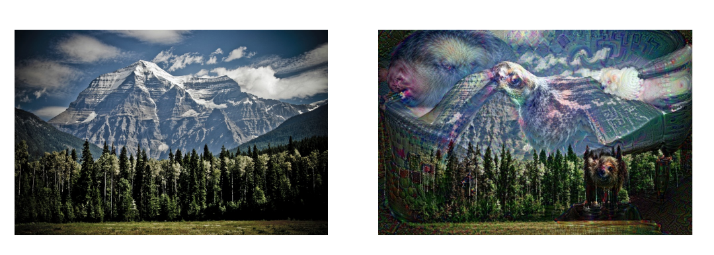
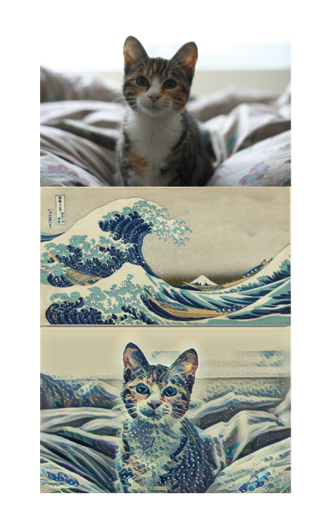

# CNN Layers
## Pooling Layers
A complicated dataset withmany different object categories will require a large number of filters, each responsible for finding a pattern in the image. More filters means a bigger stack, which means that the dimensionality or our convolutional layers can get quite large.

Higher dimensionality emans we'll need to use more parameters, which can lead to overfitting.

Tuhs, we need a method for reducing this dimensionality. This the role of polling layers within a convolutional neural network.

### Max Pooling Layer.
Max pooling layers will take a stack of feature maps as input. To construct the max pooling layer, we'll work with each feature mapped separately(卷积output的每一个channel).
For example, with `Window size: 2x2, stride: 2`, the output is a stack with the `same number of feature maps`, but each feature map has been reduced in width and height, which is half of that of the previour convolutaional layer in this case.

### Global Average Pooling Layer (GAP)
For a layer of this type, we specify neither window size nor stride. This type of pooling is a more extreme type of dimensionality reduction. It takes a stack of feature maps and computes the average value of the nodes for each map in the stack. 比如(4, 4, 3)的输出，对于每一个depth，GAP会计算每一个激活图（feature map/activation map）的平均值作为输出（这里的例子就是16个值的平均值，16就是width=4, height=4的一个二维数组），于是会得到一个(1, 1, 3)的最终结果。 In this way we see that a global averate pooling layer takes a 3D array and turns it into a vector.

### Summerize
池化层把N个激活图（feature map/activation map）作为输入，输出同样N个结果，但每个输出的激活图的width和height都变小了。
* Non-global pooling layers represent a moderate reduction in width and height, where each feature map is generally about half as tall and half as wide as its corresponding input.
* The global pooling layers reduce each input feature map to an single value

## Feature Visualization Technique
See [visualizing-conv-nets.pdf](../assets/visualizing-conv-nets.pdf)
See [guided-backprop-network-simplicity.pdf](../assets/guided-backprop-network-simplicity.pdf)
### CAM
### PCA
### t-SNE
### Occlusion Experiments
Occlusion means to block out or mask part of an image or object. For example, if you are looking at a person but their face is behind a book; this person's face is hidden (occluded). Occlusion can be used in feature visualization by blocking out selective parts of an image and seeing how a network responds.

The process for an occlusion experiment is as follows:

1. Mask part of an image before feeding it into a trained CNN,

2. Draw a heatmap of class scores for each masked image,

3. Slide the masked area to a different spot and repeat steps 1 and 2.

The result should be a heatmap that shows the predicted class of an image as a function of which part of an image was occluded. The reasoning is that **if the class score for a partially occluded image is different than the true class, then the occluded area was likely very important! 如果部分遮挡图像的分数与真实分类不同，那么遮挡区域可能非常重要！**
{Occlusion experiment with an image of an elephant.}

### Saliency Maps
Salience can be thought of as the importance of something, and for a given image, a saliency map asks: Which pixels are most important in classifying this image?

Not all pixels in an image are needed or relevant for classification. In the image of the elephant above, you don't need all the information in the image about the background and you may not even need all the detail about an elephant's skin texture; only the pixels that distinguish the elephant from any other animal are important.

Saliency maps aim to show these important pictures by computing the gradient of the class score with respect to the image pixels. A gradient is a measure of change, and so, the gradient of the class score with respect to the image pixels is a measure of how much a class score for an image changes if a pixel changes a little bit.

### Measuring change

A saliency map tells us, for each pixel in an input image, if we change it's value slightly (by dp), how the class output will change. If the class scores change a lot, then the pixel that experienced a change, dp, is important in the classification task.

Looking at the saliency map below, you can see that it identifies the most important pixels in classifying an image of a flower. These kinds of maps have even been used to perform image segmentation (imagine the map overlay acting as an image mask)!
{Graph-based saliency map for a flower; the most salient (important) pixels have been identified as the flower-center and petals.}

### Guided Backpropagation
Similar to the process for constructing a saliency map, you can compute the gradients for mid level neurons in a network with respect to the input pixels. Guided backpropagation looks at each pixel in an input image, and asks: if we change it's pixel value slightly, how will the output of a particular neuron or layer in the network change. If the expected output change a lot, then the pixel that experienced a change, is important to that particular layer.

This is very similar to the backpropagation steps for measuring the error between an input and output and propagating it back through a network. Guided backpropagation tells us exactly which parts of the image patches, that we’ve looked at, activate a specific neuron/layer.
{Examples of guided backpropagation, from [this paper](https://arxiv.org/pdf/1412.6806.pdf)}

## Summary of Feature Viz
### Deep Dream
DeepDream takes in an input image and uses the features in a trained CNN to amplifying the existing, detected features in the input image! The process is as follows:

1. Choose an input image, and choose a convolutional layer in the network whose features you want to amplify (the first layer will amplify simple edges and later layers will amplify more complex features).

2. Compute the activation maps for the input image at your chosen layer.

3. Set the gradient of the chosen layer equal to the activations and and use this to compute the gradient image.
4. Update the input image and repeat!

In step 3, by setting the gradient in the layer equal to the activation, we’re telling that layer to give more weight to the features in the activation map. So, if a layer detects corners, then the corners in an input image will be amplified, and you can see such corners in the upper-right sky of the mountain image, below. For any layer, changing the gradient to be equal to the activations in that layer will amplify the features in the given image that the layer is responding to the most.
{DeepDream on an image of a mountain}

### Style Transfer
Style transfer aims to separate the content of an image from its style. So, how does it do this?

#### Isolating content

When Convolutional Neural Networks are trained to recognize objects, further layers in the network extract features that distill information about the content of an image and discard any extraneous information. That is, as we go deeper into a CNN, the input image is transformed into feature maps that increasingly care about the content of the image rather than any detail about the texture and color of pixels (which is something close to style).

You may hear features, in later layers of a network, referred to as a "content representation" of an image.

#### Isolating style

To isolate the style of an input image, a feature space designed to capture texture information is used. This space essentially looks at the correlations between feature maps in each layer of a network; the correlations give us an idea of texture and color information but leave out information about the arrangement of different objects in an image.

#### Combining style and content to create a new image

Style transfer takes in two images, and separates the content and style of each of those images. Then, to transfer the style of one image to another, it takes the content of the new image and applies the style of an another image (often a famous artwork).

The objects and shape arrangement of the new image is preserved, and the colors and textures (style) that make up the image are taken from another image. Below you can see an example of an image of a cat [content] being combined with the a Hokusai image of waves [style]. Effectively, style transfer renders the cat image in the style of the wave artwork.

