# Attention Mechanisms

## seq2seq Recap
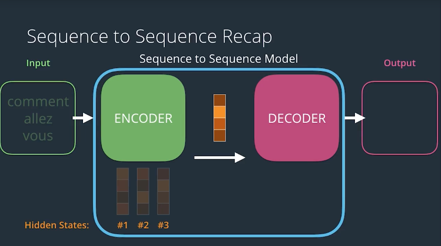
The encoder is confined to sending a single vector(context vector, between encoder and decoder.), no matter how long or short the input sequence is.

Choosing a reasonable size of this vector makes the model have problems with long input sequence. It has problems remembering information that was there is the early sequence and it doesn't have enough information to capture all of the information from that long input sequence.

What if just use a very large number of hidden units in the encoder so that the context is very large, but then your model **overfits** with short sequences, and you take a performance hit as you increase the number of parameters.

This is the problem that attention soloves.

## Encoding -- Attention Overview
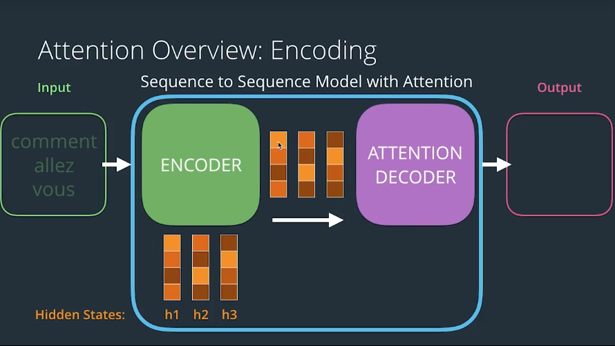
First, the Encoder process the input sequence just like the model without attention, one word at a time, producing a hidden state, and using that hidden state in the next step.

Next, the model passws a Context Vector to the decoder. But unlike the contecxt vector in the model without attention, this one is **not just the final hidden state, it's all of the hidden states**.

This gives us the benefit of having the flexibility in the context size, so longer sequence can have longer context vector that better capture the information from the input sequence.

One additional point that's important for the intuition of attention is that each hidden state is associated the most with the part of the input sequence that preceded how where word was generated.

So, the first hidden state(h1) was outputted after processing the first word, so it captures the essence of the first word the most. And so, when we focus on this vector, we will be focusing on that word the most, the same with the second hidden state with the second word, in the third with the third word. Even though that class and third vector incorporates a little bit of everything that preceded it as well.

## Decoding -- Attention Overview
At every time step, an attention decoder pays attention to the appropriate part of the input sqeuence using the context vector.

How does the attention decoder know which of the parts of the input sequence to focus on at each step? That process is learned during the traning phase. And it's not just stupidly going sequentially from the first and the second to the third, it can learn some sophisticated behavior.
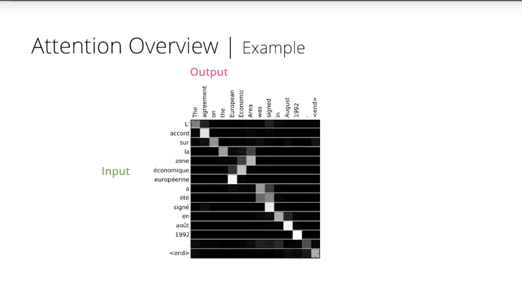

In models without attention, we'd only feed the last context vector to the decoder RNN in addition to the embedding of the end token(e.g. '<END>'), and it will begin ito generate an element of the output sequence at each timestep. The case is different in an attention decoder, however.

An attention decoder has the ability to look at the inputted words and the decoders own hidden state, and then it would do the following:
* It would use a `scoring function` to score each hidden state in the context matrix. (talk later about the scoring function). 

* After scoring, each context vector would end up with a certain score, and if we feed these scores into a softmax function, we end up with scores that are all positive, between 0 and 1 and all sum up to one. These values are how much each vector will be expressed in the `attention vector` that the decoder will look at before producing and output.

* Simply multiplying each vector by its softmax score and then summing up these vectors produces an `attention context vector`. This is a basic weighted sum operation. The context vector is an important milestone in this process, but it's not the end goal.

* merge(concatenate) `attention context vector` with a `decoders hidden state` to create the real output of the decoder at the timestep. 
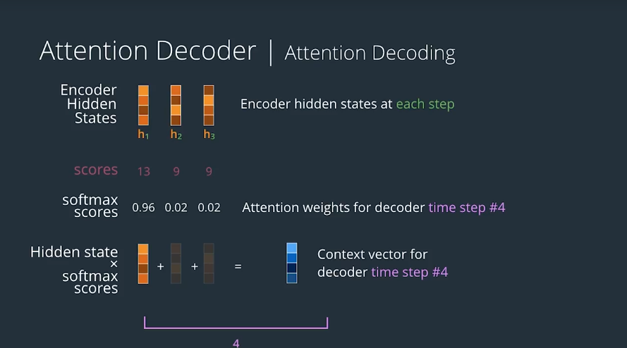

The decoder has now looked at the input word and add the attention context vector, which focuses its attention on the appropriate place in the input sequence. And so, it produces a hidden state and it produces the first word in the output sequence.

In the next timestep, the RNN takes its previous output as an input and it generates its own context vector for that timestep as well as the hidden state from the previous timestep. And that produces a new hidden state for the decoder and a new word in the output sequence. And this goes on until we've completed our output sequence.
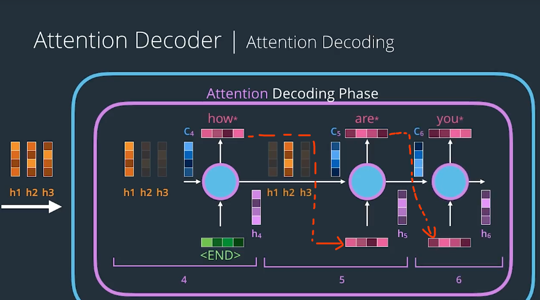

## scoring function
* Additive Attention (Bahdanau Attention)
[Neural Machine Translation by Jointly Learning to Align and Translate](https://arxiv.org/abs/1409.0473)

* Multiplicative Attention (Luong Attention)
[Effective Approaches to Attention-based Neural Machine Translation](https://arxiv.org/abs/1508.04025)

(referring to the first authors of the papers which describe them.)
### Multiplicative Attention
#### 1. dot product
An attention scoring function tends to be a fcuntion that takes in the hidden state of the decoder and the set of hidden states of the encoder. Since this is something we will do at each time step on the decoder side, we only use the hidden state of the decoder at that time step of the previous time step in some scoring methods.

$h_t$ is the hidden state of the decoder
$h_s$ is the hidden state of the encoder.
$ score(h_t, h_s) = h_t^\mathrm{T} h_s $

this would produce the vector of the scores.

Notice that the **dot product of two vectors** is equal to multiplying the lengths of the two vectors by the **cosine** of the angle between them($ |a||b|\cos \theta $). And we know that **cosine** has this convenient property that it equals one if the angle is zero and it decreases the wider the angle becomes.

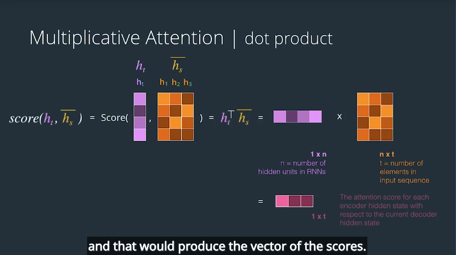

With the simplicity of this method, comes the drawback of assuming the encoder tand decoder have the same embedding space. So, while this might work for text summarization for example, where the encoder and decoder, use the same language and the same embedding space. For machine translation however, you might find that each language tends to have its own embedding space.

This is a case where we might want to use the second scoring method, which is a slight variation on the first.

#### 2. add another fully-connected layer with tanh as activation function
It simply introduces a weights matrix between the multiplication of the decoder hidden state and the encoder hidden states. This weight matrix is a linear transformation that allows the inputs and outputs to use different embeddings, and the result of this multiplication would be the weights vector.

$ score(h_t, h_s) = h_t^\mathrm{T} W_a h_s $
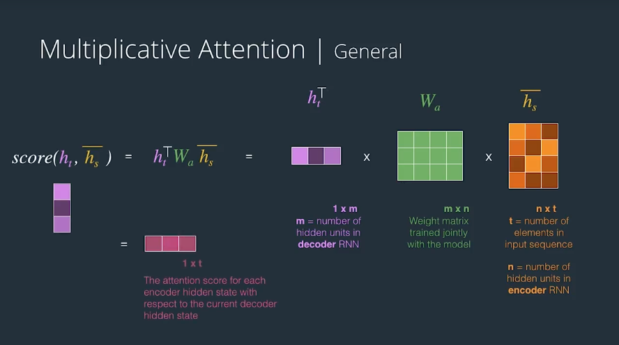

What this means is that if we have two vectors with the same length, the smaller the angle between them, the larger the dot product becomes. This dot product is a similarity measure between vectors. The dor product produces a larger number, the smaller the angle between the vectors are.
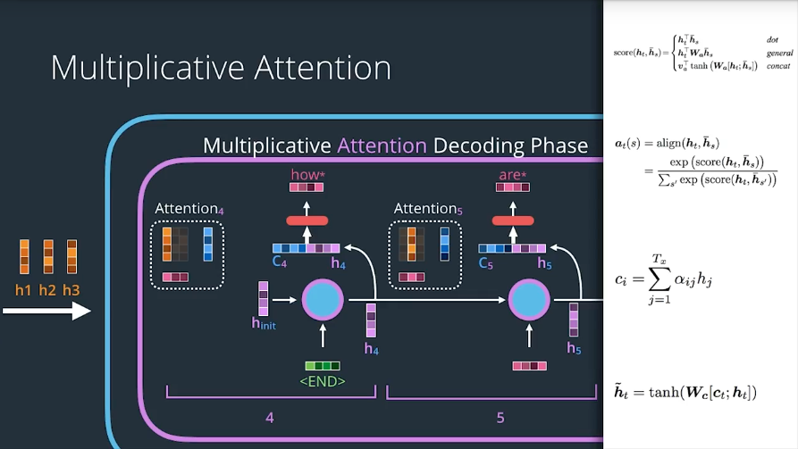

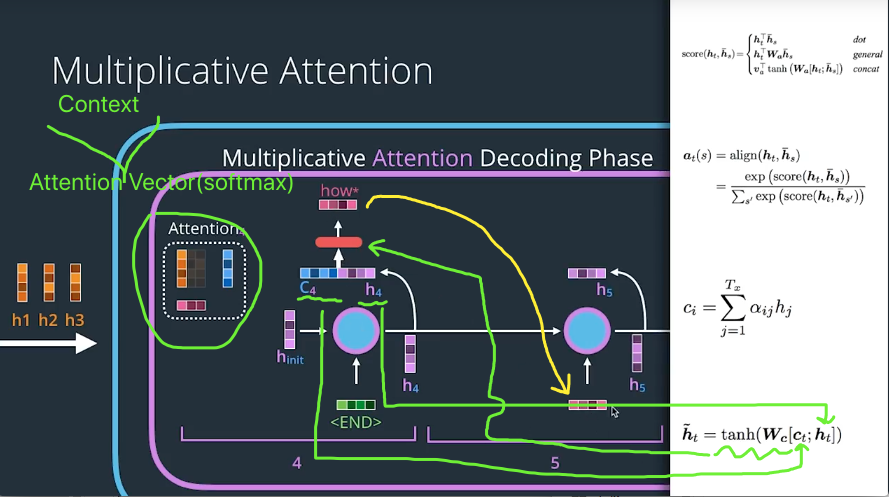

#### 3. Concat
Use a feed forward neural network.

To take a simple example，let's say we're scroing this encoder hidden state at the fourth time step at the decoder. Again, this is an oversimplified example scoring only one, while in practice we'll actually do a matrix and do it all the scoring in one step.

The Concat scoring method is commonly done by concatenating the two vectors, and making that intput to a feed forward neural network.

We merge the hidden state of decoder with the hidden state of encoder. And then we pass them through a neural network. This network has a single hidden layer. The parameters of this network are learned during the training process. Namely the $W_a$ weights matrix, and the $V_a$ weights matrix.

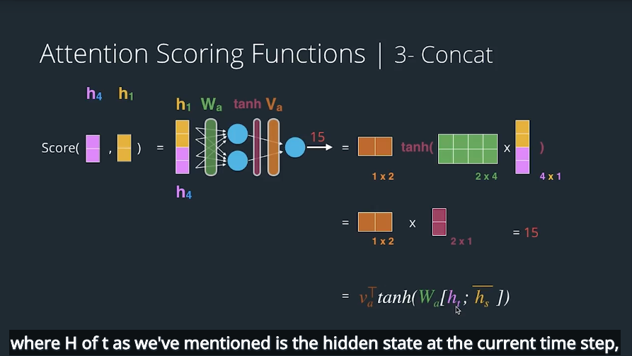

$h_t$ is the hidden state at the current time step, and $h_s$ is the collection of the set of encoder hidden states. This means `H` is for hidden state, `T` is for targets. So, $h_t$ is the target sequence that we're going to output so that's associated with the decoder. `S` is for source. (But in the Bahdanau paper $h_t$ is called S. S)

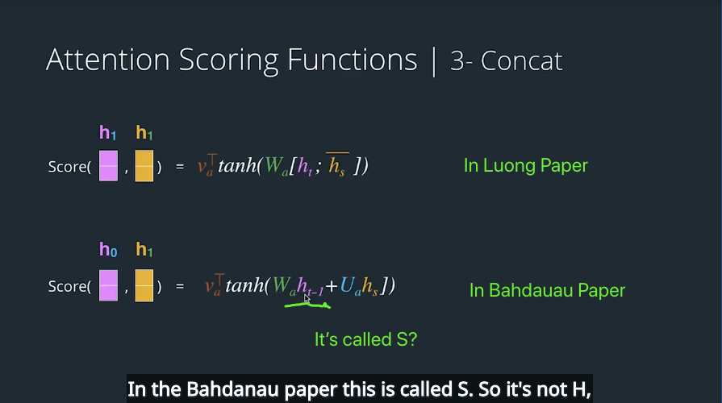

One thing to note is the difference.
So, concat is very similar to the scoring method from the `Bahdanau paper`. But this is the Concat method from the `Luong paper` where there's only one weights matrix. In the Bahdanau paper, there are two sort of major differences that we can look at. 
* One of them is that the weights matrix is split into two. So we don't have just $W_a$, we have $W_a$ and $U_a$, and each is applied to the respective vector.
* Another thing to note is that the Bahdanau paper used the hidden state from the **previous time stamp** at the decoder, while in the Luong paper it uses the one from the **current time stamp** at the decoder.

#### Other Attention Methods
**The Transformer**
The transformer model also breaks down into an encoder and a decoder. But instead of RNNs, they use feedforward neural networks and a concept called, "self-attention". This combination allows the encoder and decoder to work without RNNs, which vastly improved performance since it allows parallelization of processing that was not possible with RNNs.

The Transformer contains a stack of identical encoders and decoders. `Six` is the number the paper proposes.

Let's focus on the encoder in one layer and look at it more closely.

Each encoder layer contains two sublayers: **a multi-headed self-attention layer** and **a feed forward layer**.

As you might noticed, this attention component is completely on the encoder's side, as opposed to being a decoder component, like the previous attention machanisms we've seen.

This attention component helps the encoder comprehend its inputs by focusing on other parts of the input sequence that are relevant to each input elements it processes. This idea is an extension of work previous done on the concept of self-attention and how it can aid comprehension.

This, however is not the only attention component in the Transformer.

The deocder contains two attention conponents, one that allows it to focus on the relevant part of inputs, and another that only pays attention to a previous decoder outputs.

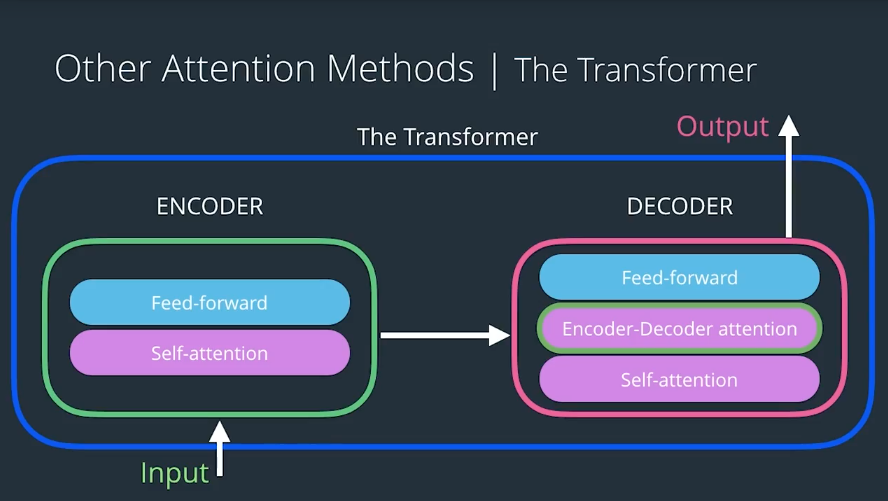

We can see how extensively this model uses attention. We can see three attention components here. They don't all work exactly the same way, but they all boil down pretty much to multiplicative attention.

Paper: [Attention Is All You Need](https://arxiv.org/abs/1706.03762)
Talk: [Attention is all you need attentional neural network models – Łukasz Kaiser](https://www.youtube.com/watch?v=rBCqOTEfxvg)