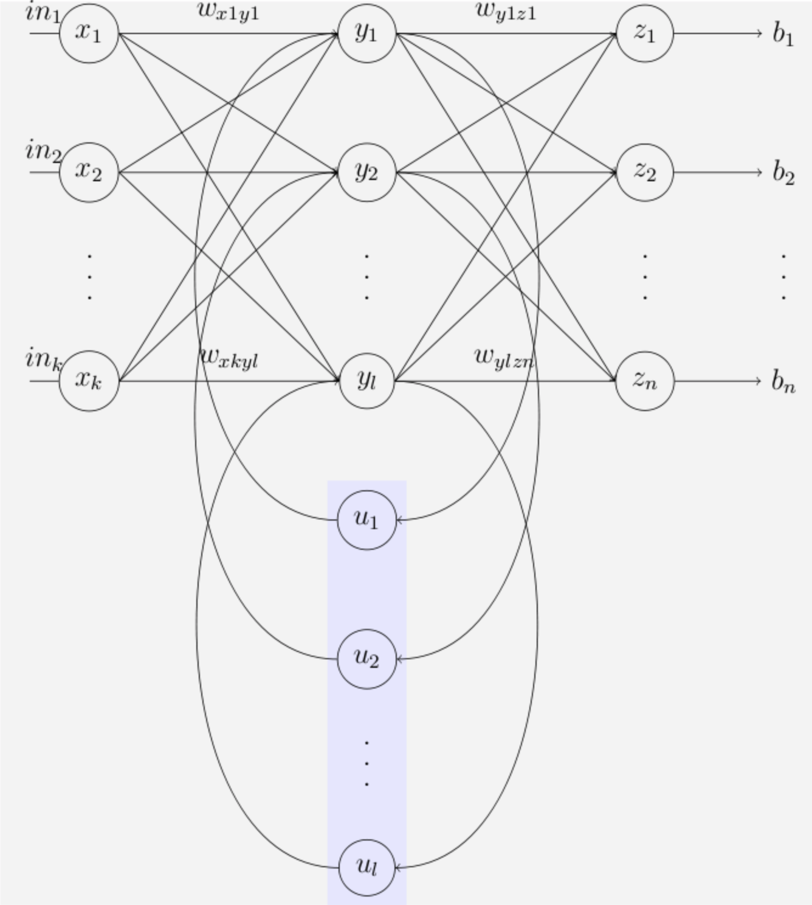

# RNN
Recurrent -- We perform the same task for each element in the input sequence.

## Applications
* Speech Recognition -- Google Assistant, Apple Siri
* Time Series Prediction
    * traffic patterns (like we predict traffic patterns on specific roads to help drivers optimize their driving paths)
    * movie selection (predict what movie a consumer will want to watch next)
    * stock movement and market conditions(hedge funds)
* Natural languague Processing (NLP)
    * machine translation
    * question answering
    * chatbots
* Gesutre Recognition

## Elman Network
[Elman Network](http://onlinelibrary.wiley.com/doi/10.1207/s15516709cog1402_1/abstract) publication from 1990. It's a significant

## RNN
hidden layer - S(state), 当系统包含memory时，我们使用这个术语，其实就是FFNN(feedforward neural network，前馈神经网络)里面的hidden layer

## How to train
When we train RNNs we also use backpropagation, but with a conceptual change. The process is similar to that in the FFNN, with the exception that we need to consider previous time steps, as the system has memory. This process is called **Backpropagation Through Time (BPTT)**

### Wy
在反向传播求导的时候，Wy的计算方法和之前一样。
而计算Ws，我们要考虑所有的状态向量。

### Ws
假设t=3，调整Ws的时候

$$ \frac{\partial E_3}{\partial W_s} = \frac{\partial E_3}{\partial y_3} \frac{\partial y_3}{\partial s_3} \frac{\partial s_3}{\partial W_s} + \frac{\partial E_3}{\partial y_3} \frac{\partial y_3}{\partial s_3} \frac{\partial s_3}{\partial s_2} \frac{\partial s_2}{\partial W_s} + \frac{\partial E_3}{\partial y_3} \frac{\partial y_3}{\partial s_3} \frac{\partial s_3}{\partial s_2} \frac{\partial s_2}{\partial s_1} \frac{\partial s_1}{\partial W_s} $$

一般来说，我们追溯多个时间步长，需要一个通用框架定义基于时间的反向传播算法来改变Ws
$$ \sum_{i=1}^N \frac{\partial E_n}{\partial y_N}\frac{\partial y_N}{\partial s_i}\frac{\partial s_i}{\partial W_s} $$

capturing relationships that span more than 8 to 10 steps back is practically impossible due to the vanishing gradient problem. We will talk about a solution to this problem in our LSTM section coming up soon.

### Wx
更新Wx和过程与更新Ws时非常相似

$$ \frac{\partial E_3}{\partial W_s} = \frac{\partial E_3}{\partial y_3} \frac{\partial y_3}{\partial s_3} \frac{\partial s_3}{\partial W_x} + \frac{\partial E_3}{\partial y_3} \frac{\partial y_3}{\partial s_3} \frac{\partial s_3}{\partial s_2} \frac{\partial s_2}{\partial W_x} + \frac{\partial E_3}{\partial y_3} \frac{\partial y_3}{\partial s_3} \frac{\partial s_3}{\partial s_2} \frac{\partial s_2}{\partial s_1} \frac{\partial s_1}{\partial W_x} $$

$$ \sum_{i=1}^N \frac{\partial E_n}{\partial y_N}\frac{\partial y_N}{\partial s_i}\frac{\partial s_i}{\partial W_x} $$

### General
A general derivation of the BPTT calculation can be displayed the following way:
$$ \frac{\partial y}{\partial W} = \sum_{t+1}^N \frac{\partial y}{\partial s_{t+N}} \frac{\partial s_{t+N}}{\partial s_i} \frac{\partial s_i}{\partial W} $$

### Tranining in mini batches using Gradient Descent
**Updating the weights once every N steps** (e.g. every 20 steps)
* Reduce the complexity
* Remove the noise

Gradient Vanished? -- LSTM -- Sepp Hochreiter and Jürgen Schmidhuber, 1997
Gradient exploding? -- Gradient cliping
