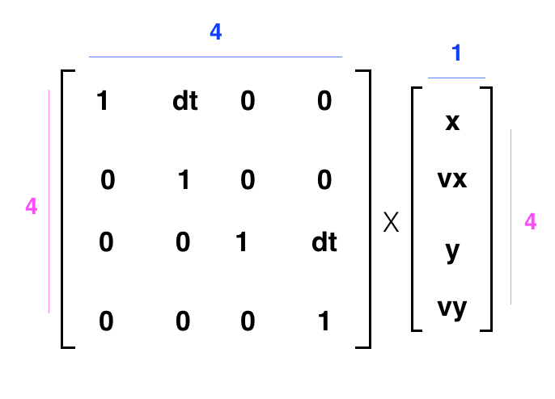
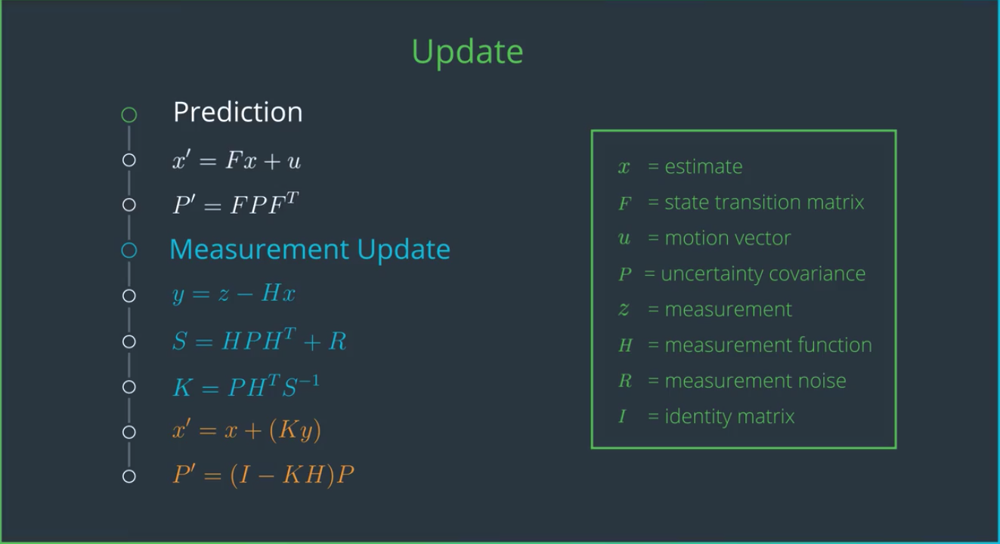

# Tracking
* Kalman Filters, an insanely popular technique for estimating the state of a system. (Continous) (Uni-modal distribution)
* Monte Carlo Localization(蒙特卡洛定位) (Discrete) (multi-modal distributions)
Both of these techniques are applicable to robot localization an dtracking other vehicles

## Kalman Filters, 卡尔曼滤波
[wikipedia](https://en.wikipedia.org/wiki/Kalman_filter)

A Kalman filter gives us a mathematical way to infer velocity from only a set of measured locations.

## state transformation matrix
if x and y are not dependent on one another. That is, there is a separate and constant x-velocity and y-velocity component. For real-world, curved and continuous motion, we still use a state vector that is one column, so that we can handle any x-y dependencies. So, you'll often see state vector and transformation matrices that look like the following.

These extra spaces in the matrix allow for more detailed motion models and can account for a x and y dependence on one another (just think of the case of circular motion). So, **state vectors are always column vectors**.

## Kalman Filter Update

$x' = x + delta_t*velocity$, in the image above, it assumes that delta t = 1

### Variable Definitions
$\hat{x}$ - state vector
$F$ - state transition matrix
$P$ - error covariance matrix
$Q$ - process noise covariance matrix
$R$ - meaturement noist covariance matrix
$S$ - intermediate matrix for calcualting Kalman gain
$K$ - Kalman gain
$\tilde{y}$ - difference between predicted state and measure state
$z$ - measurement vector(ledar data or radar data, etc.)
$I$ - Identity matrix

### Prediction Step Equations
Predict State Vector and Error Covariance Matrix
$\hat{x}_{k|k-1} = F_k \hat{x}_{k-1|k-1}$
$P_{k|k1} = F_k P_{k|k-1} F^T_k + Q_k$

### Update Step Equations
KALMAN GAIN

$S_k = H_k P_{k|k-1} H^T_k + R_k$
$K_k = P_{k|k-1}H^T_K S_k^{-1}$

Update State Vector And Error Covariance Matrix

$\tilde{y_k} = z_k - H_k \hat{x}_{k|k-1}$
$\hat{x}_{k|k} = \hat{x}_{k|k-1} + K_k \tilde{y_k}$
$P_{k|k} = (I - K_k H_k) P_{k|k-1}$