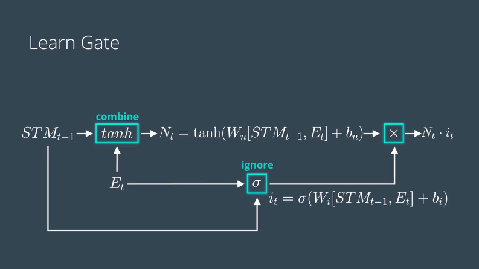
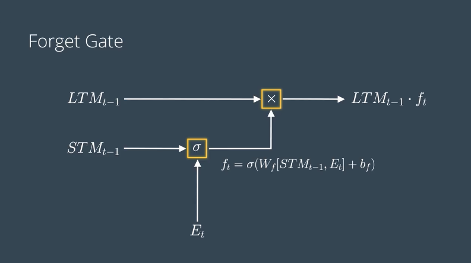
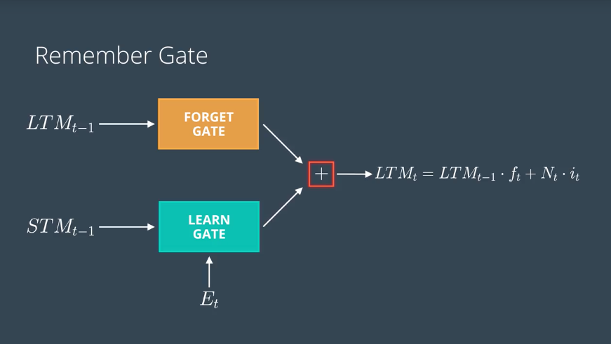
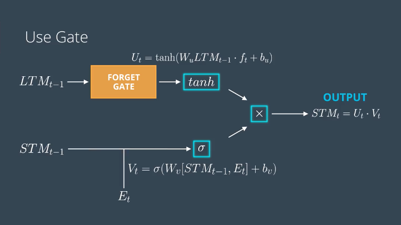
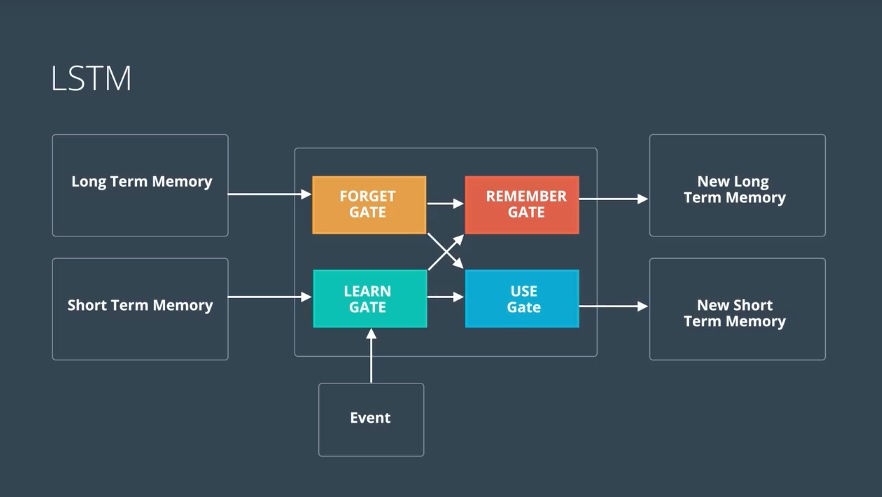
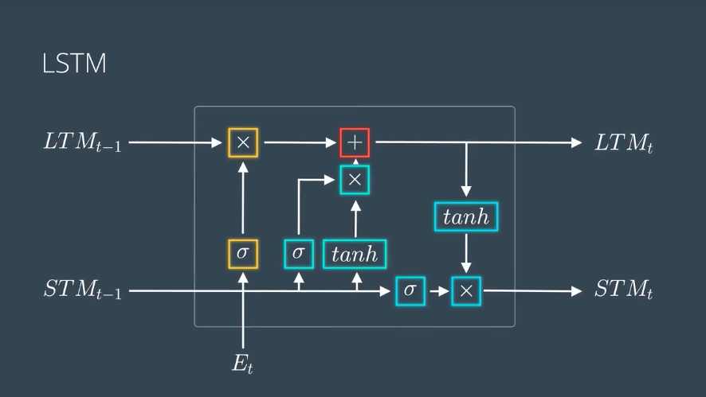

### Learning Gate，学习门
The output of the learning gate is $ N_it_i $, where:
$ N_t = \tanh(W_n[STM_{t-1}, E_t] + bias_n) $
$ i_t = \sigma(W_i[STM_{t-1}, E_t] + bias_n) $

我们有短期记忆$STM_{t-1}$和事件$E_t$，学习门会把他们合并起来，也就是把它们代入一个线性函数里，也就是把两个向量放到一起，然后乘以一个矩阵，再加一个偏差，最后讲所得结果代入到$\tanh$激活函数里。然后新信息$N_t$就产生了。

要怎么让他遗忘一部分呢？我们可以将其乘以一个遗忘因子$i_t$

`i_t`, ignore factor(遗忘因子)，实际上是一个向量，但它可以像元素一样进行乘法运算。

要怎么计算$i_t$呢，这就要用到短期记忆的之前的信息和事件了（previous information of the short term memory and the event）

所以，我们要创建一个小型神经网络，其输入为short term memory and the event, 把他们代入一个小型线性函数里，在函数里乘以一个新矩阵，再加一个新偏差，把所得结果代入sigmoid函数，使其值保持在0和1之间。

### Forget Gate，遗忘门
遗忘门，其工作原理是，遗忘门会接受一个长期记忆并决定要保留和遗忘记忆的哪个部分。遗忘门的数学原理是什么呢？

把t-1时的长期记忆（long-term memory, LTM）输入进来，乘以一个遗忘因子$f_t$。
$$ f_t = \sigma(W_f[STM_{t-1}, E_t] + bias_f) $$

用短期记忆STM以及事件信息来计算$f_t$，就和学习门一样。

### Remember Gate, 记忆门
它会接受从`遗忘门`输出的`长期记忆`，以及从`学习门`输出的`短期记忆`，然后直接把两者合并起来
$$ LTM_{t-1}f_t + N_ti_t $$

### Use Gate，使用门或输出门
它使用来自`遗忘门`的长期记忆，和来自`学习门`的短期记忆，找出新的短期记忆和输出（它们是同一个东西）。

从数学意义上来说，它按照下列进行：
1. 在遗忘门的输出上，应用使用了`双曲正切（tanh）`激活函数的小型神经网络。（It applies a small neural network on the output of the forget gate using the tanh activation function.）
2. 在短期记忆和事件上，应用使用了`sigmoid`激活函数的小型神经网络。（And it applies to another small neural network on the short term memory and the events using the sigmoid activation function.）
3. 最后一步，把两者相乘，得到新的输出。这个输出也是新的短期记忆。

The output of the Use Gate is $U_tV_t$, where:
$$ U_t = \tanh(W_uLTM_{t-1}f_t + bias_u) $$
$$ V_t = \sigma(W_u[STM_{t-1}, E_t] + bias_v) $$

### LSTM
回顾之前的图，LSTM里面有4个门
* 遗忘门，会接受长期记忆并遗忘一部分，
* 学习门，会把短期记忆和事件放到一起，作为我们最近学到的信息。
* 记忆门则把还没有遗忘的长期记忆和刚学到的新信息放到一起，以便更新长期记忆并将其输出
* 使用门也会把我们刚学到的信息和还没遗忘的长期记忆放到一起，从而作出预测并更新短期记忆。

