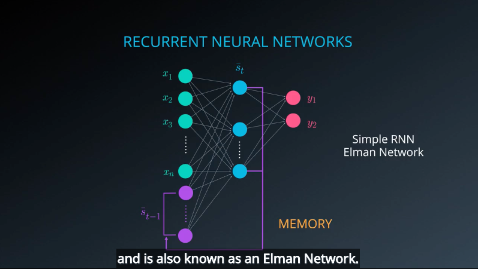
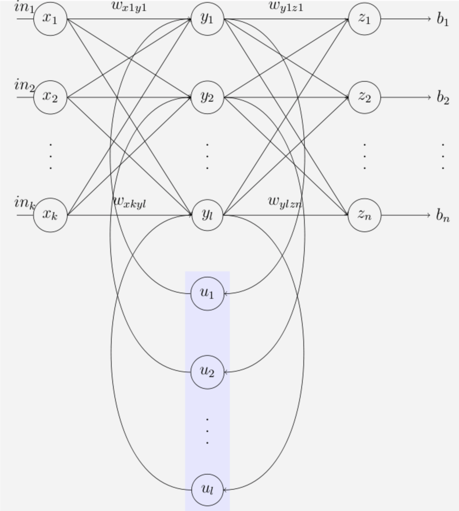

#RNN
Recurrent -- We perform the same task for each element in the input sequence.

## Applications
* Speech Recognition -- Google Assistant, Apple Siri
* Time Series Prediction
    * traffic patterns (like we predict traffic patterns on specific roads to help drivers optimize their driving paths)
    * movie selection (predict what movie a consumer will want to watch next)
    * stock movement and market conditions(hedge funds)
* Natural languague Processing (NLP)
    * machine translation
    * question answering
    * chatbots
* Gesutre Recognition

## Elman Network
[Elman Network](http://onlinelibrary.wiley.com/doi/10.1207/s15516709cog1402_1/abstract) publication from 1990. It's a significant

